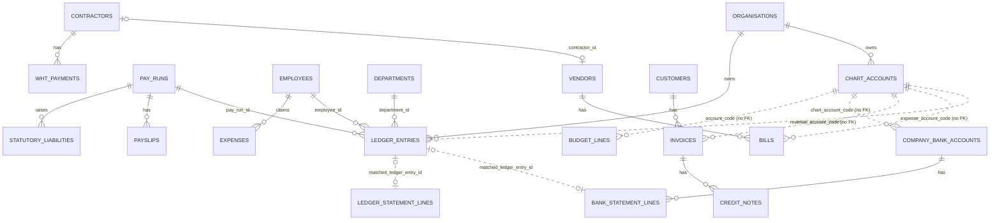
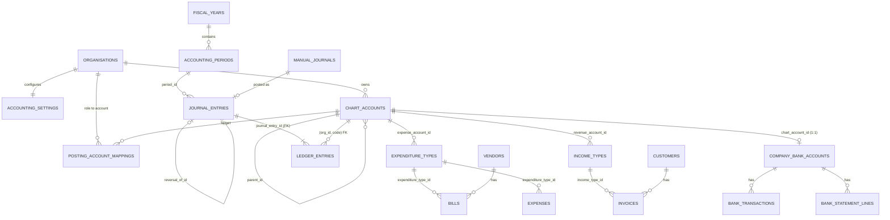

# ACCOUNTING_IMPLEMENTATION_AUDIT.md

**Plutus HR / Payroll / Business Management System — Snapshot 01**
**Accounting / Chart of Accounts: audit and proposed architecture**

| | |
|---|---|
| Status | **Proposal. Awaiting approval. No application code, schema or behaviour has been changed.** |
| Date | 2026-09-28 |
| Branch | `claude/plutus-hr-accounting-audit-ws85zr` |
| Audited | `plutus-hr-system` (FastAPI backend), `plutus-hr-system-frontend` (Next.js web), `desktop_plutus_hr-frontend` (Next.js + Electron) |
| Code baseline | Backend `main` @ `9710549`; web frontend `main` @ `b84584b`; desktop frontend `claude/dreamy-noether-miuksm` (it has no `main`). See Appendix E for how findings were re-verified against these commits. |
| Not audited | `desktop_plutus_hr-backend`: not attached to this session (see §2.4 and Assumption A1) |
| Out of scope | `plutus-technologies-landing-page` (marketing site) |

> Line and function references (`path:line`, `path` `function`) point at the code baseline above.
> "Minor" means integer minor units (kobo). This is the convention for every money column in the codebase.

---

## Contents

1. Executive Summary
2. Current Architecture
3. Existing Financial Modules
4. Existing Database Models
5. Existing Accounting Logic
6. Existing Posting Logic
7. Existing Vendor Flow
8. Existing Customer Flow
9. Existing Expense Flow
10. Existing Payroll Flow
11. Existing Bank Flow
12. Existing Tax Flow
13. Problems / Risks Found
14. Duplicate Accounting Logic Found
15. Proposed Chart of Accounts Architecture
16. Proposed Account Coding Structure
17. Proposed Expenditure Type Architecture
18. Proposed Income Type Architecture
19. Proposed Journal Architecture
20. Proposed Double-Entry Posting Engine
21. Proposed Database Changes
22. Proposed API Changes
23. Proposed UI Changes
24. RBAC Changes
25. Audit Requirements
26. Migration Strategy
27. Data Migration Risks
28. Testing Strategy
29. Rollback Strategy
30. Recommended Implementation Order

Appendices: A. Files that would need modification · B. Files that must not be modified · C. Assumptions requiring approval · D. Items requiring authoritative verification · E. Limitations of this audit

---

## 1. Executive Summary

**The system already has a working double-entry accounting core, so this is not a greenfield build.** The backend already contains:

- a per-organisation **chart of accounts** (`chart_accounts`) with 22 default accounts;
- an **append-only, double-entry ledger** (`ledger_entries`). A database trigger enforces debits = credits for every journal, and a second trigger forbids `UPDATE`/`DELETE`;
- **AP**: vendors, bills (draft → approve → pay), recurring bills, and VAT/WHT on bills;
- **AR**: customers, invoices (draft → sent → paid), credit notes and recurring invoices;
- **payroll postings** for every payslip, **NSITF** accrual, **pay-run reversal** by compensating entries, and **contractor WHT** postings;
- **fixed assets** (acquire, depreciate, dispose, revalue), **budgets** with budget-vs-actual, **trial balance**, **balance sheet**, **income statement**, **AP/AR aging** and vendor/customer statements;
- **company bank accounts** mapped to a GL code, with bank reconciliation (implemented twice; see §14);
- **statutory liability** tracking (PAYE by state, pension, NHF, NSITF, ITF, WHT) with file and remit status;
- an **audit log**, an **approval workflow engine** (leave, expense, bill) and a **fine-grained permission model** (`Permission.ACCOUNTING_MANAGE`).

The work is therefore to **harden, connect and extend** what exists. The user's brief already names the right target architecture. Most of it can be reached by evolving existing tables. It does not need parallel ones.

### Most important findings

| # | Severity | Finding |
|---|---|---|
| 1 | **High** | **Liabilities are accrued but never cleared.** Marking a pay run paid, remitting a statutory liability, disbursing a loan and approving or reimbursing an expense claim post **nothing**. `net_pay_payable`, `paye_payable`, `pension_payable` and the others grow forever, cash is overstated, and `employee_loan_receivable` goes negative. The balance sheet is wrong for any organisation that uses these flows. |
| 2 | **High** | **Payroll posts to accounts that are not in the chart.** `benefit_deductions_recovered` and `union_dues_payable` are posted but never seeded, so the balance sheet and income statement **silently drop them**. `vat_receivable`, `revaluation_surplus` and `revaluation_loss` were never backfilled for existing organisations. New organisations get **no chart at all** until someone clicks "Seed Default Accounts". |
| 3 | **High** | **There are two posting paths.** A validated path (`post_manual_journal_entry`) is used by bills, invoices, credit notes and fixed assets. A direct-insert path (payroll, NSITF, reversal, WHT) bypasses chart-of-accounts validation completely. There is no DB-level link from a ledger line to an account. |
| 4 | **High** | **Invoice payment after a credit note over-credits AR.** Payment always clears the full invoice amount, so AR goes negative. |
| 5 | **High** | **There is no accounting date, no journal header, no source link and no periods.** Reports filter on the row's `created_at`. Bills and invoices are linked to their journal only by free-text description. Nothing stops a posting into an already-reported month. |
| 6 | Medium | **Audit logging is incomplete.** PR #40 covered bills, invoices, credit notes, budgets, manual journals, fixed assets and one bank-reconciliation API. The chart of accounts, vendors, customers, company bank accounts (and their reconciliation) and recurring templates still write none. Ledger rows themselves carry no `created_by`. |
| 7 | Medium | The fine-grained RBAC (`require_permission`) is built but **used nowhere**. The auditor role sees accounting pages in the navigation, but the API returns 403. |
| 8 | Medium | Payments always credit `cash`. Bank accounts are not selectable at payment time, and several bank accounts can share one GL code. |
| 9 | Medium | **The fixed-asset register no longer matches the GL.** The company-asset merge migration (PR #46) inserted assets with placeholder costs and no acquisition journal, so batch depreciation will expense assets that were never capitalised (P26). |

### Recommended direction

1. **Keep** `chart_accounts` as the chart of accounts and `ledger_entries` as the journal lines. **Add** a `journal_entries` header table whose primary key is the `journal_entry_id` every ledger row already carries, so no historical rows are rewritten.
2. **Promote** the existing `post_manual_journal_entry` into the single **posting service** (`app/services/posting.py`). Route the four direct-insert sites through it and prove the output is byte-identical.
3. **Extend** `chart_accounts` with parent, level, description, posting/header flag, `updated_at` and a **configurable account number**. Keep today's slug `code` (e.g. `paye_payable`) as the immutable system key that 5+ services and every historical ledger row already reference.
4. Add **posting-account mappings** (role → account) so services stop hard-coding `"cash"` and `"accounts_payable"`.
5. Add the **missing clearing postings**: salary disbursement, statutory remittance, loan disbursement, expense claims and ITF accrual.
6. Make **expenditure types and income types** catalogues that map onto posting accounts. They replace the free-text `Expense.category` and the raw account pickers on bills and invoices.
7. Add **accounting periods**, generalised **reversal**, **permission-based RBAC** (the dependency already exists) and **audit events** for every accounting mutation.

A small **Phase 0** of correctness fixes (findings 2 and 4) is recommended before Phase 1 (see §30 and Assumption A22).

---

## 2. Current Architecture

### 2.1 Repositories

| Repository | Role | Stack |
|---|---|---|
| `plutus-hr-system` | **Backend and system of record.** The brief calls this "Frontend / Main System", but it is the FastAPI API. | Python 3.12, FastAPI, SQLAlchemy 2.0 (sync `Session`), Alembic, PostgreSQL 16 (psycopg 3), Pydantic v2, PyJWT + argon2 + pyotp (TOTP MFA), slowapi, APScheduler (in-process scheduler), reportlab (PDFs), boto3 (object storage), Railway deploy |
| `plutus-hr-system-frontend` | Web UI | Next.js 16.3.4 (App Router, client components), React 19.2, Tailwind v4 ("Ledger" design system), lucide-react. Plain `fetch` via `src/lib/api/client.ts`, typed endpoints in `src/lib/api/endpoints.ts`, types in `src/lib/types.ts`, role navigation in `src/lib/nav.ts` |
| `desktop_plutus_hr-frontend` | Offline desktop build | Near-copy of the web frontend plus `electron/` (spawns embedded Postgres, the bundled backend and a Next standalone server). It already diverges from the web app in places (routes, endpoint wrappers, labels), so every UI change must be made twice. |
| `desktop_plutus_hr-backend` | Desktop backend (per the desktop frontend README, bundled by its `desktop/build.sh`) | **Not inspected.** See §2.4. |

### 2.2 Backend layering (existing convention, to be followed)

```
app/api/v1/<module>.py      FastAPI routers. Auth deps, HTTP errors, audit events are recorded here.
app/services/<module>.py    DB-aware business logic. Takes a Session and returns models. Raises ValueError.
app/domain/...              Pure calculators. No ORM, no FastAPI (e.g. domain/payroll/postings.py).
app/compliance/...          Versioned statutory rule sets as frozen Pydantic models (NG-2026.1).
app/models/<table>.py       SQLAlchemy 2.0 typed models.
app/schemas/<module>.py     Pydantic *Create / *Update / *Out.
alembic/versions/           The only way schema ships. CI runs `alembic upgrade head` on a fresh DB.
```

Cross-cutting conventions that any accounting work must keep:

- **Tenancy:** RLS via `set_config('app.current_org', …, true)` in `tenant_session` (`app/core/db.py:23`). Every business table has `ENABLE` + `FORCE ROW LEVEL SECURITY` and a policy on `org_id`.
- **Money:** `BIGINT` minor units, never float. There is no currency column anywhere, so NGN is implied.
- **Append-only:** `forbid_update_delete()` triggers on `ledger_entries`, `payslips`, `audit_logs`, `wht_payments`, `credit_notes`, `loan_repayments`, `final_settlements`, fixed-asset transfers/revaluations and others.
- **Errors:** services raise `ValueError`, routers map it to 400. Lifecycle conflicts are 409 (pay runs).
- **Auth:** JWT claims carry `org_id`, `account_id` and `role`. `require_roles(...)` gates by role. `require_permission(...)` exists (`app/core/deps.py:59`) but is unused.
- **CI gates** (`.github/workflows/ci.yml`): ruff, ruff format, `mypy --strict app`, `alembic upgrade head`, pytest.

### 2.3 Frontend conventions

- Pages are client components using `useApiResource(() => xApi.list())`, `Card`/`Table`/`Drawer`/`Badge` from `src/components/ui`, and toasts for errors.
- Money is shown with `formatNaira` and parsed with `nairaToMinor`.
- Account selection in bills, invoices, recurring templates, budgets, bank accounts and manual journals is already a **controlled `<Select>` of active chart accounts filtered by type**, not free text. Rule 4 is already respected in the UI but **not enforced by the API** (see P10).
- Navigation is role-filtered in `src/lib/nav.ts`. The README states the backend is the real authorisation boundary.

### 2.4 The desktop backend

The brief names `desktop_plutus_hr-backend` as the backend. It is **not** in this session's repository set, and attaching it failed with a transient permission-check error. According to `desktop_plutus_hr-frontend/README.md` it is the `plutus-hr-system` backend packaged for desktop, with embedded Postgres. **Before any migration ships, confirm whether it shares `plutus-hr-system`'s Alembic history.** A diverged schema would change the migration plan (Assumption A1).

---

## 3. Existing Financial Modules

| Module | Tables | Service | API prefix (`/api/v1`) | Posts to ledger? | Frontend route |
|---|---|---|---|---|---|
| Chart of Accounts | `chart_accounts` | `services/chart_accounts.py` | `/chart-of-accounts` (+ `/seed-defaults`) | – | `/general-ledger/chart-of-accounts` |
| General Ledger / manual journals | `ledger_entries` | `services/general_ledger.py` | `/general-ledger/entries`, `/trial-balance`, `/journal-entries` | Yes (manual) | `/general-ledger` |
| Vendors | `vendors` | `services/vendors.py` | `/vendors` | – | `/bills/vendors` |
| Bills (AP) | `bills` | `services/bills.py` | `/bills` (`/approve`, `/pay`, `/void`, `/pdf`, `/email`) | Yes | `/bills` (nav label: "Vendors") |
| Recurring bills | `recurring_bills` | `services/recurring_bills.py` | `/recurring-bills` (`/generate-due`) | No (creates drafts) | `/bills/recurring` |
| Customers | `customers` | `services/customers.py` | `/customers` | – | `/invoices/customers` |
| Invoices (AR) | `invoices` | `services/invoices.py` | `/invoices` (`/send`, `/pay`, `/void`, `/pdf`, `/email`) | Yes | `/invoices` (nav label: "Customers") |
| Credit notes | `credit_notes` (append-only) | `services/credit_notes.py` | `/invoices/{id}/credit-notes` | Yes | inside `/invoices` |
| Recurring invoices | `recurring_invoices` | `services/recurring_invoices.py` | `/recurring-invoices` | No (drafts) | `/invoices/recurring` |
| Company bank accounts + reconciliation (A) | `company_bank_accounts`, `bank_statement_lines` | `services/company_bank_accounts.py`, `services/bank_reconciliation.py` | `/company-bank-accounts/...` | No | `/bank-reconciliation` |
| Bank reconciliation (B) | `ledger_statement_lines` | `services/ledger_reconciliation.py` | `/bank-reconciliation/...` | No | `/bank-reconciliation` |
| Fixed assets (company assets merged in by PR #46) | `fixed_assets`, `fixed_asset_assignments`, `fixed_asset_transfers`, `fixed_asset_revaluations` | `services/fixed_assets.py` | `/fixed-assets` | Yes | `/fixed-assets` |
| Budgets | `budgets`, `budget_lines` | `services/budgets.py` | `/budgets` (`/actuals`) | – | `/budgets` |
| Financial statements | – (reads ledger) | `services/financial_statements.py` | `/financial-statements/balance-sheet`, `/income-statement` (+ PDF/email) | – | `/financial-statements` (P&L), `/balance-sheet` |
| Reports | – | `services/reports.py` | `/reports/ap-aging`, `/ar-aging`, vendor/customer statements, `/payroll-cost` | – | `/reports` |
| Expenses (employee claims) | `expenses`, `expense_policy_limits` | `services/expenses.py` | `/expenses` | **No** | `/expenses` |
| Contractors + WHT | `contractors`, `contractor_invoices`, `wht_payments` (append-only) | `services/contractors.py`, `contractor_invoices.py`, `wht.py` | `/contractors/...` | Yes (on payment) | `/contractors` |
| Statutory liabilities | `statutory_liabilities` | `services/statutory_liability.py` | `/statutory-liabilities` (`/file`, `/remit`) | NSITF accrual only; **remit posts nothing** | `/compliance` |
| Payroll | `pay_runs`, `payslips` (append-only), `pay_run_variance_flags`, `loan_repayments` | `services/payroll.py`, `pay_run_lifecycle.py` | `/pay-runs` | Yes (lock, reverse); **mark-paid posts nothing** | `/payroll` |
| Loans | `loans`, `loan_repayments` | `services/loans.py` | `/loans` | **No** (disbursement not posted) | `/loans` |
| Dashboard | – | `services/dashboard.py` | `/dashboard/summary` | – | `/dashboard` |
| Audit log | `audit_logs` (append-only) | `services/audit.py` | `/audit-log` | – | `/audit-log` |
| Approvals | `approval_workflow_steps`, `approval_instances`, decisions | `services/approvals.py` | `/approval-workflows`, `/approval-instances` | – | `/approval-workflows` |
| Permissions | `memberships`, `membership_permission_overrides` | `services/permissions.py` | `/permissions` | – | `/permissions` |
| Compliance rules | – (Python modules) | `app/compliance/*` | `/compliance/current-rules`, `/paye-estimate` | – | `/compliance`, `/calculator` |

### Search coverage

The whole backend (`app/`, `alembic/`, `tests/`) and both frontends' `src/` were searched for: account, chart, ledger, journal, posting, transaction, expense, income, revenue, vendor, supplier, customer, invoice, bill, payment, bank, cash, payroll, salary, tax, VAT, PAYE, WHT, receivable, payable, asset, liability, equity, profit, loss, debit and credit.

"Supplier", "expenditure", "income type" and "accounting period" have **no** matches. Those concepts do not exist yet.

---

## 4. Existing Database Models

### 4.1 Accounting-relevant tables (current)

| Table | Key columns | Constraints and notes |
|---|---|---|
| `chart_accounts` | `id` uuid PK, `org_id`, `code` varchar(64), `name`, `type` enum(asset, liability, equity, revenue, expense), `is_system`, `is_active`, `created_at` | `UNIQUE(org_id, code)`, RLS. **No** parent, level, description, posting flag, `updated_at` or number. `code` and `type` are immutable after create (`ChartAccountUpdate` only allows `name`, `is_active`). |
| `ledger_entries` | `id`, `org_id`, `journal_entry_id` uuid (**no FK, no header table**), `pay_run_id`?, `employee_id`?, `department_id`?, `account` varchar(64) (**no FK to chart**), `debit_minor`, `credit_minor`, `description`, `created_at` | CHECK non-negative; CHECK single-sided; `trg_ledger_entries_append_only`; deferred constraint trigger `trg_ledger_entry_balance`; RLS. **No indexes besides the PK.** FKs to org/pay_run/employee are `ON DELETE CASCADE`. |
| `bills` | `vendor_id`, `bill_number`, `bill_date`, `due_date`, `expense_account_code` varchar, `amount_minor`, `vat_minor`, `wht_category`, `wht_amount_minor`, `description`, `status` enum(draft, approved, paid, void), `paid_at` | `UNIQUE(org_id, bill_number)` (org-wide, not per vendor) |
| `invoices` | `customer_id`, `invoice_number`, `issue_date`, `due_date`, `revenue_account_code` varchar, `amount_minor`, `description`, `status` enum(draft, sent, paid, void), `paid_at` | `UNIQUE(org_id, invoice_number)`. **No VAT column.** |
| `credit_notes` | `invoice_id`, `credit_note_number`, `issue_date`, `amount_minor`, `reason` | append-only |
| `vendors` | `name` (unique per org), `contact_email`, `contact_phone`, `tin`, `contractor_id`? | No default expense or payable account |
| `customers` | `name` (unique per org), `contact_email`, `contact_phone`, `tin` | No default revenue or receivable account |
| `company_bank_accounts` | `bank_name`, `account_number` (unique per org), `account_name`, `chart_account_code` varchar | **No** currency, opening balance, `is_active`, `updated_at`; `chart_account_code` not unique |
| `bank_statement_lines` | `bank_account_id`, `statement_date`, `description`, `amount_minor`, `matched_ledger_entry_id` (unique) | Reconciliation A |
| `ledger_statement_lines` | `account_code`, `transaction_date`, `description`, `amount_minor`, `external_reference`, `matched_ledger_entry_id`, `matched_at`, `matched_by` | Reconciliation B |
| `expenses` | `employee_id`, `category` **free text**, `description`, `amount_minor`, `expense_date`, `receipt_url`, `payment_method` enum(reimbursement, direct_payment), `status` enum(pending, approved, rejected, reimbursed), `decided_at`, `reimbursed_at` | Mutable. Not linked to the chart. |
| `expense_policy_limits` | `category` free text, `max_amount_minor` | `UNIQUE(org_id, category)` |
| `fixed_assets` (+ transfers, revaluations) | cost, salvage, useful life, accumulated depreciation, status, department | Postings via the validated path |
| `budgets`, `budget_lines` | `period_start/end`, `department_id`?, lines `account_code` varchar | Mutable, deletable |
| `statutory_liabilities` | `pay_run_id`?, `scheme` enum(paye, pension, nhf, nsitf, itf, wht), `state`?, `authority`, `base_minor`, `amount_minor`, period, `due_date`, `status` enum(pending, filed, remitted), `remittance_reference` | Status mutable; pending rows hard-deleted on pay-run reversal |
| `wht_payments` | `contractor_id`, `category`, gross/WHT/net, `payment_date`, `due_date`, `certificate_number`, `rule_version_id` | append-only |
| `pay_runs` | period, frequency, `status` enum(draft, validated, locked, reversed), `rule_version_id`, totals, `locked_by`, `disbursed_at/by`, `reversed_at` | |
| `payslips` | gross, pensionable, pension ee/er, nhf, paye, net, `derivation` JSONB, `rule_version_id` | append-only |
| `audit_logs` | `account_id`?, `role`, `action`, `entity_type`, `entity_id`, `event_metadata` JSONB | append-only, indexed |
| `organisations` | `name`, `rc_number`, `company_tin`, payroll defaults, `states_of_operation` | **No** fiscal year, base currency or accounting settings |
| `accounts` | **login accounts** (auth), not financial accounts | Naming collision: any new "account" table must not be called `accounts`. |

### 4.2 Current model (relationships)



Dotted lines are joins on a string code with no database constraint. BILLS, INVOICES, CREDIT_NOTES, FIXED_ASSETS and WHT_PAYMENTS have **no** link to the ledger rows they created. The only link is free-text `description`.

---

## 5. Existing Accounting Logic

### 5.1 Chart of accounts

- **Defaults.** `DEFAULT_ACCOUNTS` (`app/services/chart_accounts.py:11-42`) has 22 slug-coded accounts: `cash`, `employee_loan_receivable`, `payroll_expense_gross`, `payroll_expense_employer_pension`, `payroll_expense_nsitf`, `contractor_expense`, `paye_payable`, `pension_payable`, `nhf_payable`, `nsitf_payable`, `wht_payable`, `vat_receivable`, `net_pay_payable`, `accounts_payable`, `accounts_receivable`, `revenue`, `fixed_assets`, `accumulated_depreciation`, `depreciation_expense`, `disposal_gain_loss`, `revaluation_surplus`, `revaluation_loss`.
- **Seeding.** `seed_default_chart_of_accounts` is idempotent. It runs **only** from `POST /chart-of-accounts/seed-defaults` (`app/api/v1/chart_accounts.py:43`). `signup_organisation` (`app/services/organisation.py:11`) does not seed (still true on `main` after PR #42 changed it).
- **Migration backfills.** Four migrations backfilled defaults for pre-existing organisations: `307a5785cad6` (12 codes), `94fe2eddc7f2` (AP, AR), `a606cc3ab34e` (revenue), `2156fc6509cc` (4 fixed-asset codes). **`vat_receivable`, `revaluation_surplus` and `revaluation_loss` were never backfilled.**
- **Existing numbering convention.** There is **no numeric convention**. Codes are lowercase snake_case slugs, and the UI placeholder reads `e.g. accounts_receivable`. The model docstring (`app/models/chart_account.py:21-26`) says the table "categorizes those existing codes by type rather than replacing them".
- **Contra-asset handling.** `accumulated_depreciation` is typed `asset` and nets naturally. This is documented in migration `2156fc6509cc`. `disposal_gain_loss` is typed `expense`, so a gain shows as a negative expense.

### 5.2 Validation

- `post_manual_journal_entry` (`app/services/general_ledger.py:91-150`) checks: at least 2 lines, codes exist in the org's chart, non-negative, single-sided, and total debits = total credits. It does **not** check `is_active`, account type or date.
- Bills require an `expense`-type code, invoices a `revenue`-type code, bank accounts an `asset`-type code. None of these check `is_active`.
- DB level: CHECK non-negative and single-sided per line; deferred trigger checks balance per `journal_entry_id` at commit; append-only trigger.

### 5.3 Reporting

- **Trial balance** (`general_ledger.py:68-88`) loads **every** ledger row into Python, groups by code and joins names. Accounts not in the chart show `account_type = null`. There is no as-of date.
- **Balance sheet and income statement** (`financial_statements.py`) filter on `created_at`. Accounts not in the chart are **skipped** (`:33`). The balance sheet has no retained or current-year earnings, and its docstring admits it won't balance (`:40-46`).
- **Budget vs actual** (`budgets.py:163-219`) filters by `created_at` and ignores `budget.department_id`.
- **AP/AR aging and statements** (`reports.py`) read `bills` and `invoices` directly, not the ledger (see P14).
- **Dashboard** accounting summary aggregates selected codes in Python.

---

## 6. Existing Posting Logic

### 6.1 Every place that writes `ledger_entries`

| # | Event | Code | Debit | Credit | Path |
|---|---|---|---|---|---|
| 1 | Payslip processed (pay run **lock**) | `services/payroll.py:432-446` using `domain/payroll/postings.py:13-69` | `payroll_expense_gross`, `payroll_expense_employer_pension` | `paye_payable`, `pension_payable` (ee + er), `nhf_payable`, `employee_loan_receivable`, `benefit_deductions_recovered`, `union_dues_payable`, `net_pay_payable` | **Direct insert.** Sets `pay_run_id`, `employee_id`, `department_id`. One journal per payslip. |
| 2 | NSITF accrual (per pay run) | `services/statutory_liability.py:126-148` | `payroll_expense_nsitf` | `nsitf_payable` | **Direct insert** |
| 3 | Pay-run reversal | `services/pay_run_lifecycle.py:249-266` | mirror of every line with this `pay_run_id` | mirror | **Direct insert** (one reversal journal for the whole run) |
| 4 | Contractor payment with WHT | `services/wht.py:73-105` | `contractor_expense` (gross) | `cash` (net), `wht_payable` | **Direct insert**, `cash` hard-coded |
| 5 | Bill approved | `services/bills.py:63-101` | `bill.expense_account_code`, `vat_receivable` | `wht_payable`, `accounts_payable` (amount + VAT − WHT) | Validated (`post_manual_journal_entry`) |
| 6 | Bill paid | `services/bills.py:104-125` | `accounts_payable` | `cash` (the API never passes another account) | Validated |
| 7 | Invoice sent | `services/invoices.py:55-77` | `accounts_receivable` | `invoice.revenue_account_code` | Validated |
| 8 | Invoice paid | `services/invoices.py:80-105` | `cash` | `accounts_receivable` (**full invoice amount**) | Validated |
| 9 | Credit note | `services/credit_notes.py:44-54` | `invoice.revenue_account_code` | `accounts_receivable` | Validated |
| 10 | Fixed asset acquired | `services/fixed_assets.py` `register_fixed_asset` | `fixed_assets` | `cash` | Validated |
| 11 | Depreciation | `fixed_assets.py` `record_depreciation` | `depreciation_expense` | `accumulated_depreciation` | Validated |
| 12 | Disposal | `fixed_assets.py` `dispose_fixed_asset` | `accumulated_depreciation`, `cash` (proceeds), `disposal_gain_loss` (loss) | `fixed_assets` (cost), `disposal_gain_loss` (gain) | Validated |
| 13 | Revaluation | `fixed_assets.py` `revalue_fixed_asset` | `fixed_assets` / `revaluation_loss` | `revaluation_surplus` / `fixed_assets` | Validated |
| 14 | Manual journal | `general_ledger.py:91-150` via `POST /general-ledger/journal-entries` | any chart code | any chart code | Validated; **posts immediately with no approval**. Audit event `ledger_entry.create` since PR #40, but no `created_by` on the rows. |

**Conclusion.** There is already a *de facto* central posting function (`post_manual_journal_entry`), but it is not universal. Paths 1–4 bypass it. The payroll posting *builder* (`build_payslip_postings`) is a good pattern: a pure domain function that returns balanced postings, with unit tests. The proposed engine generalises that pattern.

### 6.2 Business events that post nothing today

| Event | Where | Expected posting (proposal) |
|---|---|---|
| Pay run marked paid (salaries disbursed) | `pay_run_lifecycle.py:187-196` | Dr `net_pay_payable` / Cr bank |
| Statutory liability remitted | `statutory_liability.py:195-204` | Dr `<scheme>_payable` / Cr bank |
| ITF annual liability raised | `statutory_liability.py:155-183` | Dr ITF expense / Cr ITF payable |
| Loan disbursed to employee | `services/loans.py` (no disbursement state) | Dr `employee_loan_receivable` / Cr bank |
| Expense claim approved | `services/expenses.py:61-68` | Dr expense account / Cr employee reimbursements payable |
| Expense claim reimbursed | `services/expenses.py:71-81` | Dr employee reimbursements payable / Cr bank |
| Union dues remitted to union | (no flow) | Dr `union_dues_payable` / Cr bank |
| Output VAT on invoices | (no field) | Cr VAT payable (output) |
| Bank charges, interest, transfers between banks | (no flow) | via bank transactions |
| Opening balances | only possible via manual journal | dedicated opening-balance journal |

---

## 7. Existing Vendor Flow

### 7.1 State machine (as built)

```
Vendor (create / update; no delete)
  └─ Bill: DRAFT ──approve (approval engine: request_type=BILL, multi-step)──▶ APPROVED ──pay──▶ PAID
            │          posts: Dr expense, Dr vat_receivable / Cr wht_payable, Cr AP     posts: Dr AP / Cr cash
            └─void──▶ VOID   (only from DRAFT, before anything posted)
RecurringBill template ──generate-due──▶ Bill (DRAFT)
```

- `POST /bills` creates the bill and an approval instance (`app/api/v1/bills.py` `create_bill`). `POST /bills/{id}/approve` records an approval step and runs `approve_bill` only on the final step (`approve`). Each action writes an audit event (PR #40).
- WHT is computed **at approval** from `RuleVersion.wht` resolved on `bill_date` (`bills.py:69-73`).
- VAT is a **caller-entered amount**, deliberately not computed (`app/models/bill.py:49-53`).

### 7.2 Compared with the desired flow

| Desired | Status |
|---|---|
| New or existing vendor | ✅ exists (`/bills/vendors`) |
| Create bill, select expense account | ✅ controlled select of active expense accounts |
| Save, then approve | ✅ with configurable multi-step approval |
| Unpaid bill: Dr Expense / Cr AP | ✅ exists (plus VAT and WHT lines) |
| Payment: Dr AP / Cr Bank | ⚠️ credits `cash` only; no bank account choice, no payment date or reference |
| No duplicate expense on payment | ✅ payment touches AP only |
| Partial payments | ❌ payment is all-or-nothing |
| Cancel an approved bill | ❌ no reversal path (the model docstring defers it) |
| Traceability bill → journal | ❌ description text only |
| Expenditure type on bill | ❌ raw expense account only |

### 7.3 Parallel contractor flow

`Contractor → ContractorInvoice (draft → submitted → paid) → record_contractor_payment` posts **cash-basis** (Dr `contractor_expense` / Cr `cash` + `wht_payable`) with **WHT at payment**. This is a second AP model (see D2).

---

## 8. Existing Customer Flow

```
Customer (create / update)
  └─ Invoice: DRAFT ──send──▶ SENT ──pay──▶ PAID
                     posts: Dr AR / Cr revenue      posts: Dr cash / Cr AR (full amount)
              └─void──▶ VOID (only from DRAFT)
     CreditNote (on SENT or PAID; cumulative ≤ invoice amount): Dr revenue / Cr AR
RecurringInvoice template ──generate-due──▶ Invoice (DRAFT)
Reports: AR aging (SENT, net of credit notes), customer statement (+ PDF/email)
```

Compared with the desired flow: invoice → AR/revenue ✅; payment → Dr Bank / Cr AR ✅, with no duplicate revenue ✅. Gaps:

1. **Credit note, then payment, over-credits AR** (P6). Payment credits the full `amount_minor`.
2. A **credit note on a PAID invoice** credits AR, which is already zero. There is no customer-credit or refund liability.
3. **No output VAT** on invoices.
4. **No WHT deducted by the customer.** In Nigeria, corporate customers often withhold tax on payment, which creates a WHT receivable or tax credit (see Appendix D).
5. There are no partial receipts and no bank account selection.
6. There is no income type; a raw revenue account is chosen.

---

## 9. Existing Expense Flow

There are two different concepts. The brief's "Expenditure" is the second.

**(a) Employee expense claims** (`expenses`): submit (policy cap by free-text category) → approve or reject (approval engine, `ApprovalRequestType.EXPENSE`) → mark reimbursed.

- **No ledger posting at any stage.** The expense never reaches the income statement.
- `category` is free text (`app/models/expense.py:51`) with no link to the chart. `ExpensePolicyLimit` is keyed by the same string.
- `payment_method = reimbursement` says "paid out through the next pay run's disbursement", but payroll does not read expenses. `reimbursed` is a status flag only.

**(b) Direct expenditure** (company pays a supplier directly: rent, electricity, diesel): **this does not exist as a flow.** The only ways to record one today are:

- a Bill approved and then paid (two journals via AP); or
- a manual journal (no vendor, no document, no approval); or
- a contractor payment (contractors only).

There is no expenditure-type catalogue, no supporting-document field on bills, and no bank or cash account selection.

---

## 10. Existing Payroll Flow

```
PayRun DRAFT ──validate (TIN gate, variance flags)──▶ VALIDATED ──lock──▶ LOCKED ──reverse──▶ REVERSED
   └─discard (hard delete, nothing posted yet)            │ run_pay_run: payslips + ledger + statutory liabilities
                                                          └─mark-paid: sets disbursed_at/by only (no posting)
```

- **Calculation is untouched by this proposal.** `app/domain/payroll/*` are pure calculators driven by the versioned `RuleVersion` (`app/compliance/versions/ng_2026_1.py`).
- **Postings already match the brief's conceptual payroll posting.**
  - Debit salary expense (`payroll_expense_gross`) and employer contribution (`payroll_expense_employer_pension`, `payroll_expense_nsitf`).
  - Credit net salary payable (`net_pay_payable`), PAYE payable, pension payable, NHF payable, NSITF payable and other deductions (loan recovery, benefit recovery, union dues).
- Granularity is **one journal per payslip**, carrying `employee_id` and `department_id` for cost-centre reporting. NSITF is one journal per run.
- Reversal is exemplary: a compensating journal, filed/remitted liabilities preserved, and loans, overtime and encashments restored.

**Gaps (accounting only):**

1. Salary payment is not posted (Dr `net_pay_payable` / Cr bank).
2. Statutory remittances are not posted.
3. ITF accrual is not posted.
4. Loan disbursement is not posted, so the receivable goes negative as payroll recovers it.
5. `benefit_deductions_recovered` and `union_dues_payable` are missing from the chart.
6. Payroll postings bypass chart validation.
7. The accounting date is lock time, not the pay-period end.
8. The PAYE liability is split by state in `statutory_liabilities`, but the ledger has one `paye_payable` account. That is acceptable, because the state split is a sub-ledger, but it should be stated.

---

## 11. Existing Bank Flow

- `company_bank_accounts` holds bank name, account number, account name and `chart_account_code` (must be an existing `asset` account). There is create, list and get; **no update or deactivate**.
- **Reconciliation A** (`/company-bank-accounts/{id}/statement-lines`, `bank_statement_lines`): manual statement lines, match or unmatch to a ledger line on the same code (amount must be equal), and a summary of bank vs ledger balance plus unmatched items.
- **Reconciliation B** (`/bank-reconciliation/statement-lines`, `ledger_statement_lines`): bulk import by `account_code`, match or unmatch with `matched_by` and `matched_at`, and a status of unmatched items. The same idea is implemented twice, with different tables (D1).

**Gaps:**

- Payments cannot choose a bank; everything credits `cash`.
- Several bank accounts can share one GL code, which makes per-bank balances and reconciliation meaningless.
- There is no opening balance, currency or active flag.
- The account number is returned in full in list responses.
- There are no bank transactions (charges, interest, transfers).
- Statement lines are manual or bulk-API only; there is no file import.

---

## 12. Existing Tax Flow

| Aspect | Current state |
|---|---|
| Tax rules | `app/compliance/models.py` `RuleVersion` (PAYE bands and reliefs, pension, NHF, NSITF, ITF, WHT categories), effective-dated in `app/compliance/versions/ng_2026_1.py`, resolved by `resolve_rule_version(country, date)`. Rates are integer ppm, with sources in `.claude/skills/plutus-payroll-python/references/nigeria-statutory-compliance.md`. **This already separates tax rules from accounting.** |
| WHT categories | Only `goods` and `services` are configured; the rule file says to confirm others against the NRS schedule. The **frontend hard-codes** the same two options (`NewBillDrawer` in `bills/page.tsx`). |
| VAT | **No VAT rule** exists in the compliance engine or the statutory reference. Bills take a caller-entered `vat_minor` and post it to `vat_receivable`. Invoices have no VAT. |
| Liabilities | `statutory_liabilities` per scheme and period (PAYE per state), with due dates from the rule version. Status moves pending → filed → remitted **without ledger impact**. |
| Tax accounts | Hard-coded slugs in services. There is no mapping between a tax scheme and its GL account. |
| Certificates | WHT certificate number per contractor payment; annual tax reconciliation certificate per employee (`payroll_reports`). |

---

## 13. Problems / Risks Found

| ID | Sev. | Finding | Evidence | Impact |
|---|---|---|---|---|
| P1 | High | Payroll posts `benefit_deductions_recovered` and `union_dues_payable`, which are not in `DEFAULT_ACCOUNTS` | `domain/payroll/postings.py:62,65` vs `services/chart_accounts.py:11-42` | Trial balance shows `account_type=null`. Balance sheet and income statement **silently exclude** them (`financial_statements.py:33`), so union dues owed are invisible and statements don't reconcile to the trial balance. |
| P2 | High | `vat_receivable`, `revaluation_surplus` and `revaluation_loss` were never backfilled for pre-existing organisations | no match for these codes in `alembic/versions/` | Approving a bill with VAT or revaluing an asset fails with "unknown account code" in older organisations until someone re-seeds. |
| P3 | High | New organisations get no chart of accounts automatically | `services/organisation.py:11` (`signup_organisation`); seeding only in `api/v1/chart_accounts.py:43` | Payroll posts to codes that don't exist in the chart; bills and invoices fail until seeded. |
| P4 | High | Four posting sites insert `LedgerEntry` directly, and there is no FK from `ledger_entries.account` to `chart_accounts` | `payroll.py:432`, `statutory_liability.py:126`, `pay_run_lifecycle.py:252`, `wht.py:73` | Violates Rule 1. Deactivated or unknown accounts can receive postings. |
| P5 | High | Clearing entries are missing for salary payment, statutory remittance, loan disbursement, expenses and ITF | §6.2 | Liabilities never clear, cash is overstated, loan receivable goes negative, expenses are missing from P&L. |
| P6 | High | Invoice payment credits the full invoice amount even after credit notes; credit notes on paid invoices credit a zero AR | `invoices.py:88-99`, `credit_notes.py:35-54` | Negative AR, overstated cash, no refund or credit liability. |
| P7 | High | There is no accounting (entry) date: every report filters on `created_at` | `general_ledger.py:35-38`, `financial_statements.py:26-29`, `budgets.py:182-185` | A bill dated 31 Jan approved on 3 Feb lands in February. Backdated opening balances are impossible. Payroll lands at lock time, not period end. |
| P8 | High | There is no journal header and no source link | `ledger_entries` has only `journal_entry_id`, `pay_run_id`, `employee_id` | Cannot trace report → ledger → journal → bill/invoice/asset (Rule 20). Cannot find "the journal for bill X" except by parsing descriptions. |
| P9 | Medium | Audit logging is incomplete, and ledger rows have no `created_by` | PR #40 added events to `bills`, `invoices`, `credit_notes`, `budgets`, `general_ledger`, `fixed_assets`, `bank_reconciliation`. `record_audit_event` is still absent from `api/v1/{chart_accounts,vendors,customers,company_bank_accounts,recurring_bills,recurring_invoices}.py`. | Chart changes, vendor/customer edits, bank-account creation and reconciliation matches on the bank-account API are unattributable. Journals can only be attributed by joining the audit log on `journal_entry_id`. |
| P10 | Medium | `is_active` is not enforced server-side, and system accounts can be deactivated | `general_ledger.py:104-106`, `bills.py:15-21`, `invoices.py:13-19`, PATCH allows `is_active` on `is_system` rows | The UI filters, but the API accepts inactive accounts. |
| P11 | Medium | `cash` is hard-coded as the credit side of every payment, and bank-to-GL mapping is not 1:1 | `bills.py:104`, `invoices.py:80-82`, `wht.py:89`, `fixed_assets.py` (`register_fixed_asset`, `dispose_fixed_asset` default `cash_account_code="cash"`); `company_bank_account.py:35` not unique | No per-bank ledger balances; reconciliation conflates banks. |
| P12 | Medium | No segregation of duties: manual journals post immediately; with no workflow configured one user can create, approve and pay a bill | `general_ledger.py`, `approvals` fallback to role gate | Fraud and error risk; no maker-checker. |
| P13 | Medium | `require_permission` and `Permission.ACCOUNTING_MANAGE` are unused; accounting is gated only by role | `core/deps.py:59`, `domain/permissions.py:9` | Permission overrides configured in the UI have no effect on accounting. |
| P14 | Medium | AP aging and vendor statements use `bill.amount_minor`, but GL AP is credited `amount + VAT − WHT` | `reports.py:125-139, 226-228` vs `bills.py:88-93` | The AP sub-ledger does not reconcile to the AP control account when VAT or WHT is present. |
| P15 | Medium | Balance sheet has no retained or current-year earnings | `financial_statements.py:40-46` | Assets ≠ liabilities + equity by design. |
| P16 | Medium | Auditor sees accounting pages in the navigation, but those APIs exclude `AUDITOR` | the "Accounts" group in frontend `src/lib/nav.ts` vs `_MANAGE` in `api/v1/{general_ledger,chart_accounts,bills,invoices,financial_statements,fixed_assets,budgets,company_bank_accounts}.py` | Auditors hit 403s; the audit role is effectively broken for accounting. |
| P17 | Medium | Bill and invoice numbers are unique **per organisation**, not per vendor | `models/bill.py:32` (`uq_bill_org_number`) | Two vendors both sending "INV-001" cannot both be recorded. The API error message says "for this vendor", which is misleading. |
| P18 | Medium | No indexes on `ledger_entries`; the balance trigger scans by `journal_entry_id` on every insert; reports aggregate in Python | migration `a9e0853f4b4b` (PK only); `general_ledger.py:70` | Lock time and report latency grow with ledger size. |
| P19 | Low-Med | `ON DELETE CASCADE` from `ledger_entries` to organisation, pay run and employee, which contradicts append-only | migration `a9e0853f4b4b:103-105` | Deleting an employee or pay run with postings errors on the trigger. Intent should be `RESTRICT`. |
| P20 | Low | Expense category is free text, WHT categories are hard-coded in the frontend, and bill VAT is a free amount | `models/expense.py:51`, `NewBillDrawer` in `bills/page.tsx`, `models/bill.py:54` | Inconsistent categorisation; no link to the chart. |
| P21 | Low | Bills and invoices can be voided only from draft; approved or sent documents have no cancel path | model docstrings | Stuck records; only a manual journal can correct them. |
| P22 | Low | Budget `department_id` is ignored in budget-vs-actual | `budgets.py:182-189` | Department budgets compare against org-wide actuals. |
| P23 | Low | Two near-identical frontends | `plutus-hr-system-frontend` vs `desktop_plutus_hr-frontend` | Every UI change must be made twice, and they already diverge. |
| P24 | Info | Backfill migrations read `organisations`, which has `FORCE ROW LEVEL SECURITY` | e.g. `307a5785cad6:70` | Backfills only work when migrations run as a superuser or `BYPASSRLS` role; otherwise they **silently insert nothing**. Must be confirmed per environment, desktop included. |
| P25 | Info | No currency on any money column | all models | Fine for NGN-only, but the journal should carry a currency column now to avoid a later rewrite. |
| P26 | Medium | Company assets migrated into `fixed_assets` by PR #46 were inserted **without an acquisition journal**, at `purchase_value_minor` or a ₦100 placeholder cost with a 36-month life | `alembic/versions/de798b342bdb_merge_company_assets_into_fixed_assets.py` (`_PLACEHOLDER_COST_MINOR`, data migration `INSERT INTO fixed_assets … FROM company_assets`) | The fixed-asset register no longer reconciles to the `fixed_assets` GL account. `run_batch_depreciation` will post depreciation (Dr `depreciation_expense` / Cr `accumulated_depreciation`) for assets never capitalised, which is a small but real P&L misstatement. Needs an accountant-reviewed opening-balance journal or exclusion from batch depreciation until real costs are entered. |

---

## 14. Duplicate Accounting Logic Found

| ID | Duplicate | Where | Recommendation |
|---|---|---|---|
| D1 | **Two bank reconciliation implementations** with separate tables and endpoints, both matching ledger lines independently. A ledger line can be matched once in each. | `services/bank_reconciliation.py` + `bank_statement_lines` vs `services/ledger_reconciliation.py` + `ledger_statement_lines` | Keep the **bank-account-scoped** version (A), since it is tied to `company_bank_accounts`. Port B's extras into A: bulk import, `external_reference`, `matched_by`/`matched_at`. Freeze B read-only and remove it later. Never drop its data. |
| D2 | **Two AP models.** Bill is accrual via AP with WHT at approval. Contractor invoice/payment is cash-basis with WHT at payment. | `services/bills.py` vs `services/wht.py` + `contractor_invoices.py` | Short term, route both through the posting engine with the same account mappings. Longer term, converge contractor invoices onto Bill (vendor with `contractor_id`) once WHT timing is confirmed (A13, A17). |
| D3 | **Two posting paths** (validated vs direct insert) | §6.1 | One posting service (§20). |
| D4 | **Balance aggregation re-implemented 5 times** | `general_ledger.trial_balance`, `financial_statements._debit_credit_totals`, `budgets.budget_vs_actual`, `dashboard`, `bank_reconciliation.reconciliation_summary` | One `ledger_queries` module with SQL `GROUP BY` and an entry-date filter. |
| D5 | **Account lookup helpers re-implemented 5 times** | `_expense_account_or_raise`, `_revenue_account_or_raise`, `_asset_account_or_raise`, `_chart_accounts_by_code`, `_accounts_by_code` (×2) | One `chart_accounts.resolve(...)` with type, active and posting checks. |
| D6 | **Categorisation duplicated** | `Expense.category` free text, `ExpensePolicyLimit.category`, `Bill.expense_account_code` | Expenditure types (§17) become the single catalogue. Policy limits are keyed by expenditure type. |
| D7 | **Default chart list duplicated** in the service and in four migrations | `chart_accounts.DEFAULT_ACCOUNTS` + migrations | Acceptable (migrations must be frozen), but add a test asserting every code any posting builder can emit is in `DEFAULT_ACCOUNTS`. That test would have caught P1. |
| D8 | **Two frontends** | web vs desktop | Out of scope to merge now, but every accounting UI change must be applied to both or extracted into a shared package (A23). |

---

## 15. Proposed Chart of Accounts Architecture

**Extend `chart_accounts`. Do not create a new table.**

### 15.1 Structure

- The five **account types** stay the root classification: asset, liability, equity, revenue, expense. They are the existing enum. Optionally add a `normal_balance` derived property (debit for asset and expense; credit for the others) and an `is_contra` flag, so contra accounts such as accumulated depreciation are explicit.
- **Hierarchy** via `parent_id` (self-FK) with a stored `level`. A child must have the same `type` as its parent. Cycles are rejected.
- **Header accounts** (`is_posting = false`) group children and can never receive a journal line. **Posting accounts** (`is_posting = true`) are leaves. **"Account Groups" are header accounts**, not a separate table (A4).
- **System accounts** (`is_system = true`): cannot be deleted, cannot be deactivated while mapped to a posting role, and keep type and system key immutable. They can be renamed or renumbered.
- **Deactivation** is allowed only for accounts that are not mapped to a posting role, not referenced by an active expenditure type, income type or bank account, and (configurable) have a zero balance. Deactivated accounts stay visible in history and reports.
- **Deletion** is never allowed for an account with ledger lines. The FK in §21 makes this structural. Unused custom accounts may be deleted.

### 15.2 Rules enforced by the posting engine (§20)

Every line must reference an **existing, active, posting** account in the same organisation, and the journal must balance. This covers Rules 1–5.

### 15.3 Default chart (template for review, not final)

This is a **template**. It must be reviewed by a qualified Nigerian accountant (IFRS / IFRS for SMEs as adopted by FRC Nigeria) before use (Appendix D). Existing slug codes are shown in `code` to demonstrate that nothing already posted changes. Numbers use the proposed default 4-digit ranges (§16, A3).

| No. | Name | Type | Posting | System key (`code`) | Status |
|---|---|---|---|---|---|
| 1000 | Current Assets | asset | header | `hdr_current_assets` | new |
| 1010 | Cash on Hand | asset | ✔ | `cash` | existing |
| 1100 | Bank Accounts | asset | header | `hdr_bank_accounts` | new (each company bank account becomes an 11xx child) |
| 1200 | Accounts Receivable | asset | ✔ | `accounts_receivable` | existing |
| 1210 | Employee Loans Receivable | asset | ✔ | `employee_loan_receivable` | existing |
| 1300 | VAT Receivable (Input VAT) | asset | ✔ | `vat_receivable` | existing (backfill) |
| 1310 | WHT Receivable (tax credits) | asset | ✔ | `wht_receivable` | new; only if A19 is approved |
| 1400 | Inventory | asset | ✔ | `inventory` | new, optional; no inventory module exists |
| 1500 | Fixed Assets | asset | ✔ | `fixed_assets` | existing |
| 1590 | Accumulated Depreciation | asset (contra) | ✔ | `accumulated_depreciation` | existing |
| 2000 | Accounts Payable | liability | ✔ | `accounts_payable` | existing |
| 2100 | Payroll Liabilities | liability | header | `hdr_payroll_liabilities` | new |
| 2110 | Net Pay Payable | liability | ✔ | `net_pay_payable` | existing |
| 2120 | PAYE Payable | liability | ✔ | `paye_payable` | existing |
| 2130 | Pension Payable | liability | ✔ | `pension_payable` | existing |
| 2140 | NHF Payable | liability | ✔ | `nhf_payable` | existing |
| 2150 | NSITF Payable | liability | ✔ | `nsitf_payable` | existing |
| 2160 | ITF Payable | liability | ✔ | `itf_payable` | new |
| 2170 | Union Dues Payable | liability | ✔ | `union_dues_payable` | **posted today, missing from the chart** |
| 2180 | Employee Reimbursements Payable | liability | ✔ | `employee_reimbursements_payable` | new |
| 2200 | Tax Liabilities | liability | header | `hdr_tax_liabilities` | new |
| 2210 | VAT Payable (Output VAT) | liability | ✔ | `vat_payable` | new |
| 2220 | WHT Payable | liability | ✔ | `wht_payable` | existing |
| 2300 | Customer Credits / Unapplied Receipts | liability | ✔ | `customer_credits` | new (fixes P6) |
| 3000 | Share Capital / Owner's Equity | equity | ✔ | `owners_equity` | new |
| 3100 | Retained Earnings | equity | ✔ | `retained_earnings` | new |
| 3200 | Current Year Earnings | equity | ✔ (system, computed; year-end close only) | `current_year_earnings` | new |
| 3300 | Revaluation Surplus | equity | ✔ | `revaluation_surplus` | existing (backfill) |
| 3900 | Opening Balance Equity | equity | ✔ | `opening_balance_equity` | new |
| 4000 | Revenue | revenue | ✔ | `revenue` | existing |
| 4100 | Service Revenue | revenue | ✔ | `service_revenue` | new |
| 4200 | Other Income | revenue | ✔ | `other_income` | new |
| 5000 | Payroll Costs | expense | header | `hdr_payroll_costs` | new |
| 5010 | Salaries and Wages (Gross Pay) | expense | ✔ | `payroll_expense_gross` | existing |
| 5020 | Employer Pension Contribution | expense | ✔ | `payroll_expense_employer_pension` | existing |
| 5030 | NSITF Contribution | expense | ✔ | `payroll_expense_nsitf` | existing |
| 5040 | ITF Levy | expense | ✔ | `payroll_expense_itf` | new |
| 5050 | Staff Benefits Recovered | expense (contra) | ✔ | `benefit_deductions_recovered` | **posted today, missing from the chart**; type needs a decision (A18) |
| 5100 | Contractor Expense | expense | ✔ | `contractor_expense` | existing |
| 5200 | Rent | expense | ✔ | `rent_expense` | new (example) |
| 5300 | Utilities | expense | ✔ | `utilities_expense` | new (example) |
| 5400 | Office Expenses | expense | ✔ | `office_expense` | new (example) |
| 5500 | Transportation | expense | ✔ | `transport_expense` | new (example) |
| 5600 | Bank Charges | expense | ✔ | `bank_charges` | new |
| 5700 | Professional Services | expense | ✔ | `professional_fees` | new (example) |
| 5750 | Repairs and Maintenance | expense | ✔ | `repairs_maintenance` | new (example) |
| 5800 | Depreciation | expense | ✔ | `depreciation_expense` | existing |
| 5810 | Revaluation Loss | expense | ✔ | `revaluation_loss` | existing (backfill) |
| 5820 | Gain/Loss on Disposal | expense | ✔ | `disposal_gain_loss` | existing |
| 5900 | Other Operating Expenses | expense | ✔ | `other_operating_expense` | new (example) |

"New (example)" accounts would be in a **selectable template**, not force-seeded. "Existing" and backfill rows are required by current posting code and must be present for every organisation.

---

## 16. Proposed Account Coding Structure

### 16.1 The existing convention and why it constrains us

The codebase already has one coding system: **slug codes** (`chart_accounts.code`, e.g. `paye_payable`). Those strings are:

- stored in every historical `ledger_entries.account` row, which is append-only by trigger and so cannot be rewritten;
- referenced as literals in 6 services and 1 domain module;
- stored in `bills.expense_account_code`, `invoices.revenue_account_code`, `company_bank_accounts.chart_account_code`, `budget_lines.account_code`, `recurring_*`, and `ledger_statement_lines.account_code`.

Replacing them with numbers would require rewriting append-only history, which is forbidden (Rules 13, 16, 17).

### 16.2 Recommendation: one accounting code, one internal key

| Field | Purpose | Who sees it | Mutable? |
|---|---|---|---|
| `id` (uuid) | Row identity and FK target for all **new** references | nobody | no |
| `code` (existing slug) | **Internal system key.** Stable identifier used by code and history. Auto-generated for new custom accounts (e.g. `acct_5210`). | developers and the API | **no** (already immutable) |
| `account_number` (new, varchar(20)) | **The accounting code**: "5200 Rent". Unique per organisation, validated against configurable ranges. Shown everywhere in the UI and on reports. | accountants and users | yes, audited (renumbering never touches ledger rows because lines reference `code`/`id`) |

These are **not competing systems**. Users only ever see and choose `account_number · name`. The slug is an internal key that already exists and cannot be removed without destroying history. This is the "clear reason" the brief asks for.

### 16.3 Configurable numbering

Stored in `accounting_settings` (per organisation, §21):

```json
{
  "account_number_length": 4,
  "account_number_ranges": {
    "asset":     {"from": "1000", "to": "1999"},
    "liability": {"from": "2000", "to": "2999"},
    "equity":    {"from": "3000", "to": "3999"},
    "revenue":   {"from": "4000", "to": "4999"},
    "expense":   {"from": "5000", "to": "5999"}
  },
  "enforce_ranges": true
}
```

- Validation happens in the service (not the DB), so ranges can change. A range change never renumbers existing accounts; it applies to new ones.
- The default is 4 digits because the brief's 3-digit example (100–199) allows only 100 accounts per type. That is tight once each bank account and state PAYE sub-account needs its own number (A3).
- "Suggest next number" = the smallest free number in the type's range above the parent's number.
- Existing organisations: `account_number` is **nullable at first** and pre-filled from the reviewed template by a migration. The UI shows the slug until a number exists.

---

## 17. Proposed Expenditure Type Architecture

### 17.1 Concept

An **expenditure type** is a business-facing catalogue entry ("Office Rent", "Diesel", "Internet") that **maps to exactly one expense posting account**. Many types can map to one account (Electricity and Diesel → 5300 Utilities). This is why a type cannot reuse the GL number as its own code.

| Field | Notes |
|---|---|
| `id` | uuid |
| `code` | Catalogue code, auto-suggested as `EXP-001`, `EXP-002` (prefix configurable), unique per organisation. **Identifies the type, not an accounting account.** The accounting source of truth is always `expense_account_id` (A5). |
| `name` | Unique per organisation, case-insensitive (`lower(name)` unique index) |
| `expense_account_id` | FK → `chart_accounts.id`. Must be `type = expense`, `is_posting`, active. |
| `description` | text |
| `default_vat_treatment`, `default_wht_category` | optional defaults; categories come from the compliance `RuleVersion`, never typed |
| `requires_receipt` | bool (policy) |
| `max_amount_minor` | optional; **replaces** `ExpensePolicyLimit` keyed by free text (migrated) |
| `is_active` | Deactivate, never delete, once used |
| `created_at`, `updated_at`, `created_by` | |

"Account type" and "parent account" from the brief are **derived** from the linked expense account (type is always expense; parent is the linked account's parent). They are not stored twice.

### 17.2 Where types are used

1. **Direct expenditure** (the brief's §4 flow). **Recommendation: reuse `bills`** with `settlement = 'immediate'` instead of creating a new table (A6):
   - Fields: vendor (existing or quick-create), expenditure type → **displays** the linked expense account read-only, amount, date, description, reference, payment method, bank or cash account (select of bank accounts, never a free GL code), VAT and WHT, and a supporting document (`attachment_url`, the same URL-reference pattern as `expenses.receipt_url`).
   - It goes through the **same bill approval workflow**. On final approval it posts **one** journal: Dr expense (+ Dr input VAT) / Cr bank (+ Cr WHT payable). It never touches AP and never appears in AP aging.
   - Example: Office Rent ₦500,000 → Dr 5200 Rent ₦500,000 / Cr 1110 GTBank Operating ₦500,000.
2. **Bills on account.** Choosing an expenditure type sets `expense_account_code` (kept for compatibility) and `expenditure_type_id`.
3. **Employee expense claims.** `expenses.expenditure_type_id` replaces free-text `category`. The old column is kept, read-only, for history. Posting:
   - on approval: Dr expense / Cr Employee Reimbursements Payable;
   - on reimbursement: Dr Reimbursements Payable / Cr bank (direct), or included in the next pay run (a later decision).

### 17.3 Validation

Duplicate code and name rejected (unique indexes plus a friendly 400). The account must be an active expense posting account. A type used by any document cannot be deleted, only deactivated. Changing a type's account affects **future** documents only; posted journals already carry the resolved account.

---

## 18. Proposed Income Type Architecture

This mirrors §17:

| Field | Notes |
|---|---|
| `id`, `code` (`INC-001`, configurable), `name` (unique) | |
| `revenue_account_id` | FK → `chart_accounts`, must be `type = revenue`, posting, active |
| `default_vat_treatment` | categories from the compliance rule version once VAT is verified (A12) |
| `description`, `is_active`, timestamps, `created_by` | |

**Used by:**

- `invoices.income_type_id` (sets `revenue_account_code`, kept for compatibility) and `recurring_invoices`.
- **Direct receipts** (money received without an invoice: interest, scrap sales): mirror of §17.2 by reusing `invoices` with `settlement = 'immediate'`. Posting: Dr bank / Cr revenue (+ Cr output VAT).

**Invoice posting (unchanged shape):** Dr AR ₦1,000,000 / Cr 4100 Service Revenue ₦1,000,000. **Receipt:** Dr bank / Cr AR. Revenue is never posted again on payment (Rule 12, already true).

---

## 19. Proposed Journal Architecture

### 19.1 Tables

```
journal_entries   (NEW, header; PK = the existing ledger_entries.journal_entry_id values)
ledger_entries    (EXISTING, lines; unchanged rows, gains FKs and indexes)
```

**No separate `journal_lines` table.** `ledger_entries` already *is* the journal-lines table, append-only and balance-checked. Creating another would duplicate it.

**`journal_entries` columns**

| Column | Notes |
|---|---|
| `id` uuid PK | equals `ledger_entries.journal_entry_id` |
| `org_id` | RLS |
| `journal_number` | Human reference, e.g. `JV-2026-000123`. Gap-free per organisation per fiscal year, via a `document_sequences` row locked `FOR UPDATE`. Historical journals get numbers too (§26). |
| `entry_date` date | **Accounting date.** Reports filter on this. |
| `period_id` | FK → `accounting_periods` (nullable until Phase 15) |
| `source_type` | enum, see §19.2 |
| `source_id` uuid? | id of the originating document (bill, invoice, pay run, …) |
| `source_event` | e.g. `bill.approved`, `bill.paid`, `payslip.locked`; with `source_id` forms the idempotency key |
| `reference` | external or document number (bill number, invoice number, cheque, bank reference) |
| `description` | |
| `currency` | `'NGN'` default (P25) |
| `total_minor` | sum of debits (denormalised; checked by trigger) |
| `reversal_of_id` | FK → `journal_entries.id` when this journal reverses another |
| `reversal_reason` | required when `reversal_of_id` is set |
| `created_by`, `approved_by`, `posted_by` | FK → `accounts` (login accounts), nullable for scheduler or system |
| `posted_at`, `created_at` | |

- **Posted journals are append-only.** The existing `forbid_update_delete()` trigger is applied.
- "Is reversed" is **derived** by checking whether a journal exists with `reversal_of_id = this.id`, so the header never needs an UPDATE.
- A unique index on `reversal_of_id` prevents double reversal.

**Manual journal drafts** live in a separate mutable table `manual_journals` (+ `manual_journal_lines`) with status `draft → submitted → approved → posted | rejected`. Posting creates the immutable `journal_entries` + `ledger_entries`. This is the same discipline as pay runs (draft and validated are discardable; lock writes append-only rows). Approval uses the existing approval engine with a new `ApprovalRequestType.MANUAL_JOURNAL`.

### 19.2 Source types

`PAYROLL`, `PAYROLL_DISBURSEMENT`, `STATUTORY_ACCRUAL`, `STATUTORY_REMITTANCE`, `EXPENSE_CLAIM`, `EXPENSE_REIMBURSEMENT`, `EXPENDITURE`, `BILL`, `VENDOR_PAYMENT`, `CONTRACTOR_PAYMENT`, `INVOICE`, `CUSTOMER_PAYMENT`, `CREDIT_NOTE`, `RECEIPT`, `LOAN_DISBURSEMENT`, `FIXED_ASSET`, `BANK_TRANSACTION`, `MANUAL_JOURNAL`, `OPENING_BALANCE`, `REVERSAL`, `YEAR_END_CLOSE`, `LEGACY` (historical journals whose source cannot be proven).

### 19.3 Traceability (Rule 20)

- **Report line** → `GET /general-ledger/accounts/{id}?from&to` (lines with `journal_entry_id`)
- → `GET /journals/{id}` (header: `source_type`, `source_id`, number, actors, reversal links)
- → the source document route (`/bills/{source_id}`, `/pay-runs/{source_id}`, …). The frontend resolves a route per `source_type`.

---

## 20. Proposed Double-Entry Posting Engine

### 20.1 One service, evolved from what exists

New module `app/services/posting.py`. `post_manual_journal_entry` becomes a thin wrapper around it for backward compatibility.

```python
def post_journal(
    db: Session,
    *,
    org_id: uuid.UUID,
    entry_date: date,
    source_type: JournalSourceType,
    source_id: uuid.UUID | None,
    source_event: str,
    reference: str | None,
    description: str,
    lines: Sequence[PostingLine],  # account role OR account id/code, debit, credit, dims
    actor_account_id: uuid.UUID | None,
    allow_closed_period: bool = False,  # only for permitted callers (reversal into open period is the norm)
) -> JournalEntry: ...


def reverse_journal(db, *, journal_id, reversal_date, reason, actor_account_id) -> JournalEntry: ...
```

`PostingLine` carries `account` (a **posting role** or an explicit chart account id), `debit_minor`, `credit_minor`, an optional line `description`, and optional dimensions (`employee_id`, `department_id`, `pay_run_id`, later `vendor_id`/`customer_id`/`bank_account_id`). The dimensions are existing or new nullable columns on `ledger_entries`.

### 20.2 Validation order (reject means `ValueError` → 400; nothing written)

1. At least 2 lines. Each line is single-sided and has a positive amount.
2. Resolve every role through `posting_account_mappings` to a chart account. Every account must **exist, be active, and be a posting account** in this organisation (Rules 1, 4, 5).
3. Optional type guard per role (e.g. a bank line must be an asset account).
4. Σdebit = Σcredit (Rules 2, 3). The DB trigger remains as a second, independent check.
5. `entry_date` falls in an **open** period (after Phase 15; before that the check is skipped).
6. **Idempotency:** a unique index `(org_id, source_type, source_id, source_event)` for non-null `source_id` rejects a second posting of the same business event. This enforces Rule 12 structurally: a bill can be posted once for `bill.approved` and once for `bill.paid`, never twice for either.
7. Write header plus lines in the caller's transaction. The balance trigger fires at commit.
8. Return the header. **The router** records the audit event (existing convention).

### 20.3 Posting rules as pure functions

Following `domain/payroll/postings.py`, add `app/domain/accounting/posting_rules.py`. It has **pure** builders (no ORM) that turn a business event into `PostingLine`s using **roles**, never literal account codes. Hypothesis property tests assert every builder balances for all inputs.

| Business event | source_type / event | Debit | Credit |
|---|---|---|---|
| Bill approved (on account) | BILL / `bill.approved` | expense (via expenditure type), `VAT_INPUT` | `WHT_PAYABLE`, `ACCOUNTS_PAYABLE` |
| Bill paid | VENDOR_PAYMENT / `bill.paid` | `ACCOUNTS_PAYABLE` | bank account (selected) |
| Direct expenditure approved | EXPENDITURE / `expenditure.approved` | expense, `VAT_INPUT` | bank, `WHT_PAYABLE` |
| Expense claim approved | EXPENSE_CLAIM / `expense.approved` | expense (via type) | `EMPLOYEE_REIMBURSEMENTS_PAYABLE` |
| Expense claim reimbursed | EXPENSE_REIMBURSEMENT / `expense.reimbursed` | `EMPLOYEE_REIMBURSEMENTS_PAYABLE` | bank |
| Invoice sent | INVOICE / `invoice.sent` | `ACCOUNTS_RECEIVABLE` | revenue (via income type), `VAT_OUTPUT` |
| Customer payment | CUSTOMER_PAYMENT / `invoice.paid` | bank (+ `WHT_RECEIVABLE` if A19) | `ACCOUNTS_RECEIVABLE` (**outstanding** amount, net of credits) |
| Credit note (unpaid invoice) | CREDIT_NOTE / `credit_note.issued` | revenue (+ `VAT_OUTPUT`) | `ACCOUNTS_RECEIVABLE` |
| Credit note (paid invoice) | CREDIT_NOTE / `credit_note.issued` | revenue (+ `VAT_OUTPUT`) | `CUSTOMER_CREDITS` |
| Payslip locked | PAYROLL / `payslip.locked` (`source_id` = payslip) | **unchanged** from `build_payslip_postings` | **unchanged** |
| NSITF accrual | STATUTORY_ACCRUAL / `nsitf.accrued` | `NSITF_EXPENSE` | `NSITF_PAYABLE` |
| ITF accrual | STATUTORY_ACCRUAL / `itf.accrued` | `ITF_EXPENSE` | `ITF_PAYABLE` |
| Salaries paid (mark-paid) | PAYROLL_DISBURSEMENT / `pay_run.disbursed` | `NET_PAY_PAYABLE` | bank |
| Statutory remittance | STATUTORY_REMITTANCE / `liability.remitted` | `<SCHEME>_PAYABLE` | bank |
| Loan disbursed | LOAN_DISBURSEMENT / `loan.disbursed` | `EMPLOYEE_LOAN_RECEIVABLE` | bank |
| Contractor payment | CONTRACTOR_PAYMENT / `wht_payment.recorded` | `CONTRACTOR_EXPENSE` | bank, `WHT_PAYABLE` |
| Fixed asset events | FIXED_ASSET / `asset.acquired`, `.depreciated`, `.disposed`, `.revalued` | as today | as today (cash → selected bank) |
| Bank charge, interest, transfer | BANK_TRANSACTION | per type | per type |
| Opening balance | OPENING_BALANCE | per line | `OPENING_BALANCE_EQUITY` |
| Pay-run reversal and any reversal | REVERSAL (`reversal_of_id`) | mirror | mirror |
| Year-end close | YEAR_END_CLOSE | revenue accounts | expense accounts; net → `RETAINED_EARNINGS` |

### 20.4 Posting-account mappings (roles)

A `posting_account_mappings` table maps `(org_id, role)` → `chart_account_id`. It is seeded **1:1 with today's slug codes**, so behaviour is identical on day one. Roles include:

`CASH_DEFAULT`, `ACCOUNTS_PAYABLE`, `ACCOUNTS_RECEIVABLE`, `VAT_INPUT`, `VAT_OUTPUT`, `WHT_PAYABLE`, `WHT_RECEIVABLE`, `CUSTOMER_CREDITS`, `PAYROLL_GROSS_EXPENSE`, `EMPLOYER_PENSION_EXPENSE`, `NSITF_EXPENSE`, `ITF_EXPENSE`, `PAYE_PAYABLE`, `PENSION_PAYABLE`, `NHF_PAYABLE`, `NSITF_PAYABLE`, `ITF_PAYABLE`, `NET_PAY_PAYABLE`, `UNION_DUES_PAYABLE`, `BENEFIT_RECOVERY`, `EMPLOYEE_LOAN_RECEIVABLE`, `EMPLOYEE_REIMBURSEMENTS_PAYABLE`, `CONTRACTOR_EXPENSE`, `FIXED_ASSETS`, `ACCUMULATED_DEPRECIATION`, `DEPRECIATION_EXPENSE`, `DISPOSAL_GAIN_LOSS`, `REVALUATION_SURPLUS`, `REVALUATION_LOSS`, `RETAINED_EARNINGS`, `OPENING_BALANCE_EQUITY`, `BANK_CHARGES`.

Changing a mapping is permission-gated and audited, and affects future postings only.

### 20.5 Migration of existing call sites (behaviour-preserving)

| Site | Change |
|---|---|
| `payroll.py:432-446` | Build lines with `build_payslip_postings` (unchanged), then `post_journal(source_type=PAYROLL, source_id=payslip.id, entry_date=pay_run.period_end (A-decision), dims=employee/department/pay_run)` |
| `statutory_liability.py:126-148` | `post_journal(STATUTORY_ACCRUAL, …)` |
| `pay_run_lifecycle.py:249-266` | Keep the "mirror all lines of the run" semantics, via the engine, `source_type=REVERSAL` |
| `wht.py:73-105` | `post_journal(CONTRACTOR_PAYMENT, …)`, bank selectable, default `CASH_DEFAULT` |
| `bills.py`, `invoices.py`, `credit_notes.py`, `fixed_assets.py` | Swap `post_manual_journal_entry` for `post_journal` with source fields |

**Golden requirement:** for each migrated site, a test asserts that the set of `(account, debit, credit, pay_run_id, employee_id, department_id)` lines is identical before and after the refactor.

---

## 21. Proposed Database Changes

All changes are **additive**: new tables, new nullable columns, new constraints added `NOT VALID` then `VALIDATE`d. There are no drops, no column-type changes, and **no UPDATE of any append-only table**.

### 21.1 Existing model → proposed relationship

| Existing model | Proposed change | Why not a new table |
|---|---|---|
| `chart_accounts` | + `account_number`, `parent_id`, `level`, `description`, `is_posting` (default true), `is_contra`, `updated_at`, `created_by`; unique `(org_id, account_number)`; unique `(org_id, id)` for composite FKs | It is the chart of accounts. |
| `ledger_entries` | + FK `(org_id, account) → chart_accounts(org_id, code)` (`NOT VALID` → backfill chart rows → `VALIDATE`; **no row rewrite**); + FK `journal_entry_id → journal_entries.id` (same pattern); + indexes `(journal_entry_id)`, `(org_id, account)`, `(org_id, created_at)`; + nullable dims `vendor_id`, `customer_id`, `bank_account_id`, `line_no` (new rows only) | It is the journal-lines table. |
| `bills` | + `expenditure_type_id`, `settlement` (`on_account` \| `immediate`), `attachment_url`, `paid_from_bank_account_id`, `payment_reference`, `payment_date`, `vat_treatment`; later unique `(org_id, vendor_id, bill_number)` replacing the org-wide one (P17, needs approval) | It is the AP document. |
| `invoices` | + `income_type_id`, `settlement`, `vat_minor`, `vat_treatment`, `received_into_bank_account_id`, `payment_reference`, `payment_date` | It is the AR document. |
| `credit_notes` | + `vat_minor` (new rows) | – |
| `vendors` | + `default_expenditure_type_id`, `payable_account_id` (default AP control; must be a liability), `is_active` | Rule 8 |
| `customers` | + `default_income_type_id`, `receivable_account_id` (default AR control; must be an asset), `is_active` | Rule 9 |
| `company_bank_accounts` | + `chart_account_id` (unique, 1:1), `currency` (default `NGN`), `opening_balance_minor`, `opening_balance_date`, `opening_journal_id`, `is_active`, `updated_at`; account number masked in list responses | Rule 10 |
| `bank_statement_lines` | + `external_reference`, `matched_by`, `matched_at`; bulk import endpoint | absorbs D1 |
| `ledger_statement_lines` | frozen (read-only); data retained | D1 |
| `expenses` | + `expenditure_type_id`; `category` kept for history | D6 |
| `expense_policy_limits` | superseded by `expenditure_types.max_amount_minor` (migrated, then read-only) | D6 |
| `statutory_liabilities` | + `remittance_journal_id`, `paid_from_bank_account_id` | links remittance to ledger |
| `pay_runs` | + `disbursement_journal_id`, `paid_from_bank_account_id` | links salary payment to ledger |
| `loans` | + `disbursed_at`, `disbursement_journal_id`, `paid_from_bank_account_id` | P5 |
| `organisations` | – (settings go into `accounting_settings` to keep the org model small) | – |

### 21.2 New tables

| Table | Columns (summary) | Notes |
|---|---|---|
| `accounting_settings` | `org_id` PK, `fiscal_year_start_month` (1–12), numbering config JSONB (§16.3), `expenditure_type_prefix`, `income_type_prefix`, `journal_number_prefix`, `manual_journal_requires_approval` bool, `period_enforcement_enabled` bool, `base_currency` (`NGN`), `updated_at`, `updated_by` | RLS; one row per org |
| `posting_account_mappings` | `org_id`, `role`, `chart_account_id`, `updated_at`, `updated_by`; PK `(org_id, role)` | §20.4 |
| `expenditure_types` | §17.1 | unique `(org_id, code)`, `(org_id, lower(name))` |
| `income_types` | §18 | same |
| `journal_entries` | §19.1 | append-only trigger; unique `(org_id, journal_number)`; unique `(org_id, source_type, source_id, source_event)` where `source_id` is not null; unique `(reversal_of_id)` |
| `manual_journals`, `manual_journal_lines` | draft header and lines, status, `created_by`, `submitted_at`, approval link | mutable until posted |
| `document_sequences` | `org_id`, `sequence_key` (e.g. `journal:2026`), `next_value` | gap-free numbering |
| `fiscal_years` | `id`, `org_id`, `name`, `start_date`, `end_date`, `status` (open/closed), `closed_at`, `closed_by`, `closing_journal_id` | |
| `accounting_periods` | `id`, `org_id`, `fiscal_year_id`, `name` (e.g. 2026-01), `start_date`, `end_date`, `status` (open/closed/locked), `closed_at/by`, `reopened_at/by`, `reopen_reason` | `EXCLUDE USING gist` against overlap (a pattern the Python engineering reference already recommends) |
| `bank_transactions` (Phase 8) | `bank_account_id`, `type` (charge, interest, transfer_in, transfer_out, other), `amount_minor`, `transaction_date`, `counter_account_id`?, `reference`, `journal_id` | Posts via the engine |
| `tax_codes` (Phase 10, if A12 is approved as proposed) | `org_id`, `code`, `tax_type` (vat, wht), `treatment` (standard, zero_rated, exempt, out_of_scope), `rule_category` (refers to a RuleVersion category; **no rate column**), `input_role`, `output_role`, `is_active` | Rates stay in the compliance engine |

### 21.3 Proposed model



`JOURNAL_ENTRIES.source_type` + `source_id` point at BILLS, INVOICES, CREDIT_NOTES, PAY_RUNS/PAYSLIPS, EXPENSES, LOANS, STATUTORY_LIABILITIES, WHT_PAYMENTS, FIXED_ASSETS, BANK_TRANSACTIONS or MANUAL_JOURNALS. The link is polymorphic, so it has no FK; this is documented and validated in the service.

---

## 22. Proposed API Changes

These follow existing conventions: `/api/v1`, kebab-case prefixes, `tags=["accounting"]`, action sub-resources as `POST /{id}/<verb>`, Pydantic `*Create/*Update/*Out`, integer minor units, 400 for validation, 404 for missing, 409 for lifecycle conflicts, and an audit event recorded in the router after success.

### 22.1 Chart of accounts and account groups

| Method | Path | Notes |
|---|---|---|
| GET | `/chart-of-accounts?type=&active=&posting=&q=` | existing; add filters and new fields |
| GET | `/chart-of-accounts/tree` | hierarchy for the UI ("Account Groups" = header nodes) |
| POST | `/chart-of-accounts` | existing; + `account_number`, `parent_id`, `description`, `is_posting`; `code` auto-generated if omitted |
| PATCH | `/chart-of-accounts/{id}` | existing; + `account_number`, `parent_id`, `description`; system-account guards |
| POST | `/chart-of-accounts/{id}/deactivate`, `/activate` | guarded (§15.1); replaces raw `is_active` PATCH |
| POST | `/chart-of-accounts/seed-defaults` | existing; becomes "apply template" (the required set is always present after Phase 0) |
| GET | `/chart-of-accounts/next-number?type=&parent_id=` | numbering helper |

### 22.2 Settings, mappings, types

| Method | Path |
|---|---|
| GET/PUT | `/accounting-settings` |
| GET | `/posting-account-mappings` · PUT `/posting-account-mappings/{role}` |
| GET/POST | `/expenditure-types` · GET/PATCH `/expenditure-types/{id}` · POST `/{id}/deactivate` |
| GET/POST | `/income-types` · GET/PATCH `/income-types/{id}` · POST `/{id}/deactivate` |

### 22.3 Journals, ledger and periods

| Method | Path | Notes |
|---|---|---|
| GET | `/journals?from=&to=&source_type=&source_id=&account_id=&q=` | paginated headers |
| GET | `/journals/{id}` | header, lines, source link, reversal links |
| POST | `/journals/{id}/reverse` | body `{reversal_date, reason}`; permission `accounting.reverse` |
| GET/POST | `/manual-journals` · GET/PATCH `/manual-journals/{id}` | drafts |
| POST | `/manual-journals/{id}/submit`, `/approve`, `/reject`, `/post` | maker-checker |
| POST | `/general-ledger/journal-entries` | **existing, kept** for backward compatibility; creates and posts a manual journal (respecting the approval setting); deprecated in docs |
| GET | `/general-ledger/entries` | existing; filters switch to `entry_date` (header), + `journal_id`, `source_type`; paginated |
| GET | `/general-ledger/accounts/{id}?from=&to=` | account ledger with opening balance and running balance |
| GET | `/general-ledger/trial-balance?as_of=&from=` | existing; + dates, grouped by type, totals row |
| GET/POST | `/fiscal-years` (POST generates monthly periods) |
| GET | `/accounting-periods?fiscal_year_id=` |
| POST | `/accounting-periods/{id}/close`, `/reopen` (reason), `/fiscal-years/{id}/close` (year-end journal) |
| POST | `/opening-balances` | posts an OPENING_BALANCE journal (balanced against Opening Balance Equity) |

### 22.4 Changes to existing document endpoints

| Existing endpoint | Change |
|---|---|
| `POST /bills` | + `expenditure_type_id`, `settlement`, `attachment_url`, `bank_account_id` (required when `immediate`) |
| `POST /bills/{id}/pay` | body `{bank_account_id, payment_date, reference}` (all optional, defaulting to today's behaviour) |
| `POST /invoices` | + `income_type_id`, `vat_minor`/`vat_treatment`, `settlement` |
| `POST /invoices/{id}/pay` | body `{bank_account_id, payment_date, reference}`; posts the **outstanding** amount (fix P6) |
| `POST /invoices/{id}/credit-notes` | + `vat_minor`; posts to `CUSTOMER_CREDITS` when the invoice is paid |
| `POST /bills/{id}/cancel`, `POST /invoices/{id}/cancel` | new: reverse the posting of an approved or sent document (P21) |
| `POST /pay-runs/{id}/mark-paid` | body + `bank_account_id`; posts disbursement |
| `POST /statutory-liabilities/{id}/remit` | body + `bank_account_id`, `payment_date`; posts remittance |
| `POST /loans/{id}/disburse` | new |
| `POST /expenses/me` | + `expenditure_type_id` (category kept for compatibility) |
| `POST /company-bank-accounts` | + `currency`, `opening_balance_minor`, `opening_balance_date`; auto-creates the child GL account under 1100; PATCH and deactivate added |
| `/bank-reconciliation/*` | frozen, then deprecated (D1) |

Payments with partial allocation (`payments` + `payment_allocations`) are **deferred** (A-decision in Appendix C). The endpoints above keep full-payment semantics but choose the bank and settle the outstanding amount correctly.

---

## 23. Proposed UI Changes

Following the repository's `plutus-ux-architect` guidance: improve what exists, reuse the Ledger design system (flat, bordered, dense, filled status badges), and never ship a button with no backend behind it. **Every change applies to both frontends** (A23).

### 23.1 Audit classification of existing screens

| Screen | Verdict | Why / what |
|---|---|---|
| `/general-ledger/chart-of-accounts` | **Improve** | Add number column, tree/indent by parent, header vs posting badge, description, "next number" helper, guarded deactivate (not a bare badge toggle), a template picker instead of one-click "Seed". Code input is free-text slug today; make it auto-generated. |
| `/general-ledger` | **Improve → split** | Currently TB + raw lines + JE drawer on one page. Split into Trial Balance (as-of), General Ledger (account + date range, running balance, journal link) and Journals. Add a date filter (the API already supports it). |
| New Journal Entry drawer | **Rebuild** | Needs entry date, reference, attachment, maker-checker submit, and "shows account number · name". Keep the live debit/credit balance check. |
| `/bills` (nav label "Vendors") | **Improve** | Rename the nav label to "Bills"; `/bills/vendors` becomes "Vendors". Expenditure type select that **displays** the linked account read-only; bank select on Pay; attachment; "Pay immediately" option (direct expenditure); cancel with reversal. Take WHT categories from `/compliance/current-rules`, not hard-coded. Fix the "Mark Paid" confirmation, which quotes the gross `amount_minor` although the posting clears `net_payable_minor`. |
| `/invoices` (nav label "Customers") | **Improve** | Rename the label; income type select; VAT (once verified); bank on Pay; outstanding amount shown after credit notes. |
| `/expenses` | **Improve** | Expenditure type select replaces free-text category; show the linked account to approvers. |
| `/bank-reconciliation` | **Improve** | Becomes "Bank Accounts" (list with masked number, GL account, balance, active) plus a per-account reconciliation tab. Remove the second (account-code) reconciliation UI. |
| `/financial-statements` (P&L) and `/balance-sheet` | **Improve** | Use `entry_date`; balance sheet includes retained and current-year earnings and shows a "balances ✔" check; drill-down to the account ledger. |
| `/reports` (aging) | **Keep, fix data** | Use net payable and outstanding amounts so aging reconciles to control accounts. |
| `/fixed-assets`, `/budgets` | **Keep** | Minor: bank select on acquisition and disposal; department filter honoured in budget actuals. |
| `/compliance` (statutory liabilities) | **Improve** | Remit dialog gains bank account and date and shows the journal it created. |
| Navigation for auditor | **Fix** | Either grant `accounting.view` (A15) or hide the items. Today they 403. |

### 23.2 Proposed "Accounting" navigation (reusing existing routes)

```
Accounting
├── Dashboard              → widgets on the existing /dashboard (cash by bank, AP/AR due, unposted drafts, open period)
├── Chart of Accounts      → /general-ledger/chart-of-accounts (improved; "Account Groups" = tree view tab)
├── Income Types           → NEW /accounting/income-types
├── Expenditure Types      → NEW /accounting/expenditure-types
├── Customers              → /invoices/customers (existing)
├── Vendors                → /bills/vendors (existing)
├── Bills                  → /bills (existing)
├── Invoices               → /invoices (existing)
├── Payments               → later phase (partial payments); until then, pay actions live on Bills/Invoices
├── Bank Accounts          → /bank-reconciliation (renamed and improved)
├── Journals               → NEW /accounting/journals (+ manual journal drafts/approval)
├── General Ledger         → /general-ledger (improved)
├── Trial Balance          → NEW tab or route split from /general-ledger
├── Profit & Loss          → /financial-statements (existing)
├── Balance Sheet          → /balance-sheet (existing)
├── Tax                    → /compliance (liabilities, remittances) + tax codes (Phase 10)
└── Accounting Settings    → NEW /accounting/settings (numbering, fiscal year, periods, posting mappings)
```

No existing module is duplicated. Customers, Vendors, Bills, Invoices, Banks, GL and Statements are the existing pages, regrouped. "Payments" is not shown until it has a backend (the "no fake functionality" rule).

---

## 24. RBAC Changes

### 24.1 Permissions (extend `app/domain/permissions.py`)

| Permission | Grants |
|---|---|
| `accounting.view` | read chart, types, journals, GL, bank accounts, documents |
| `accounting.create` | create drafts (bills, invoices, manual journals, types, accounts) |
| `accounting.update` | edit drafts, settings, accounts, types |
| `accounting.delete` | delete **drafts** and unused custom accounts only (posted data can never be deleted) |
| `accounting.post` | post or approve documents that create journals (bill approve, invoice send, pay) |
| `accounting.approve` | approve manual journals and high-value documents (maker ≠ checker enforced) |
| `accounting.reverse` | reverse posted journals and cancel posted documents |
| `accounting.close_period` | close or reopen periods, run year-end close |
| `accounting.view_reports` | TB, P&L, BS, GL, aging, tax and payroll-liability reports |

`accounting.manage` (existing) stays as a legacy alias that expands to `view + create + update + post` during the transition, so existing permission overrides keep their meaning.

### 24.2 Proposed defaults (no automatic grants beyond these; see A14)

| Role | Default accounting permissions |
|---|---|
| admin | all |
| accountant | view, create, update, delete, post, view_reports |
| payroll_manager | view, view_reports. **This is a reduction from today's full access to bills and invoices; needs approval.** Payroll postings remain driven by `payroll.run`. |
| auditor | view, view_reports (fixes P16) |
| hr_manager, manager, department_manager, employee | none |

`approve`, `reverse` and `close_period` are **admin-only by default** and grantable per membership through the existing override UI.

### 24.3 Enforcement

- Switch accounting routers from `require_roles(...)` to the existing `require_permission(...)`, one router per PR, with tests.
- Maker-checker: the service rejects approval by the same `account_id` that created the draft.
- Frontend navigation derives visibility from effective permissions (`/permissions/{membership}/permissions` exists), not from role lists.

---

## 25. Audit Requirements

1. **Journal header** stores `created_by`, `approved_by`, `posted_by`, `posted_at`; reversals store `reversal_of_id`, `reversal_reason` and the actor.
2. **Every accounting mutation** calls `record_audit_event` in its router, which is the existing convention.
   - **Already in place on `main` (PR #40):** `bill.create|approve|pay|void`, `invoice.create|send|pay|void`, `credit_note.create`, `budget.create|update|delete`, `ledger_entry.create`, `fixed_asset.*`, `bank_reconciliation.import_statement_lines|match|unmatch`. Keep those names.
   - **Still to add** (existing and new modules): `chart_account.create|update|activate|deactivate`, `accounting_settings.update`, `posting_mapping.update`, `expenditure_type.*`, `income_type.*`, `manual_journal.create|update|submit|approve|reject|post`, `journal.reverse`, `period.close|reopen`, `fiscal_year.close`, `bill.create|approve|pay|cancel|void`, `invoice.create|send|pay|cancel|void`, `credit_note.issue`, `bank_account.create|update|deactivate`, `reconciliation.match|unmatch|import`, `fixed_asset.*`, `budget.*`, `opening_balance.post`.
3. **Audit metadata** includes `journal_number`, `journal_id`, `source_type`, `source_id`, `total_minor` and, for updates, a before/after diff of changed fields.
4. **No silent deletes.** `journal_entries` and `ledger_entries` are append-only by trigger (existing function). Documents move to `void` or `cancelled` with a reversal journal; they are never deleted once posted. Draft deletion is audited.
5. The audit-log UI gains filters by `entity_type` for accounting entities and links to `/accounting/journals/{id}`.
6. Scheduler-originated postings (recurring documents, batch depreciation) record `account_id = null` with `metadata.origin = "scheduler"`.

---

## 26. Migration Strategy

**Principle: expand → migrate → contract, one Alembic revision per phase, additive only.**

1. **Pre-flight checks** (run read-only in each environment before Phase 0):

   ```sql
   -- ledger codes with no chart row (expect: benefit_deductions_recovered, union_dues_payable, possibly payroll codes in never-seeded orgs)
   SELECT le.org_id, le.account, count(*) FROM ledger_entries le
   LEFT JOIN chart_accounts ca ON ca.org_id = le.org_id AND ca.code = le.account
   WHERE ca.id IS NULL GROUP BY 1, 2;

   -- orgs missing any required default
   SELECT o.id FROM organisations o WHERE (SELECT count(*) FROM chart_accounts c WHERE c.org_id = o.id) < 22;

   -- unbalanced journals (should be none: trigger)
   SELECT journal_entry_id FROM ledger_entries GROUP BY 1 HAVING sum(debit_minor) <> sum(credit_minor);
   ```

   Also confirm the migration role is a superuser or has `BYPASSRLS` (P24), otherwise backfills insert nothing.

2. **Backfill by INSERT only.** Insert missing default chart rows for every organisation (idempotent, skip existing). Insert `journal_entries` headers for every distinct historical `journal_entry_id`:
   - `entry_date` = `created_at` converted to `Africa/Lagos` date (A11);
   - `source_type` = `PAYROLL` when all lines share a `pay_run_id`, otherwise `LEGACY`, with the old description preserved;
   - `journal_number` assigned in `created_at` order.

   **Existing `ledger_entries` rows are never updated.**
3. **Constraints last.** Add FKs `NOT VALID`, run the validation query, then `VALIDATE CONSTRAINT`. Add indexes (`CREATE INDEX CONCURRENTLY` where the deployment allows running outside a transaction).
4. **Code switch-over behind settings.** New posting behaviours (disbursement, remittance, expense claims, period enforcement) are gated by `accounting_settings` flags. They default **off for existing organisations** and **on for new organisations**, and are enabled per organisation after the accountant reviews the catch-up report (§27).
5. **Historical uncleared balances** (e.g. months of `net_pay_payable` that were paid but never posted) are **not auto-corrected**. A "catch-up report" lists them per account, and the accountant posts reviewed adjustment journals (source `OPENING_BALANCE` or `MANUAL_JOURNAL`) (A8).
6. **Order of deploy:** migration → backend → frontends (web and desktop). CI already fails if `alembic upgrade head` fails on a fresh DB.
7. **Desktop:** every install runs migrations against its embedded Postgres. Back up the local DB before upgrade and ship the same revisions (requires A1 confirmation).

---

## 27. Data Migration Risks

| Risk | Likelihood | Mitigation |
|---|---|---|
| Backfills silently no-op because the migration role is subject to FORCE RLS (P24) | Medium | Pre-flight role check; the migration asserts inserted counts > 0 when organisations exist |
| Ledger contains codes absent from the chart, so FK validation fails | High (P1, P3) | Insert known codes first; pre-flight query; abort the migration with a clear message if unknown codes remain |
| Wrong `entry_date` for history (created vs economic date) | Certain, low impact | Documented rule (A11); history keeps `created_at`; periods for history stay open until reviewed |
| Legacy journals can't be attributed to a source | Certain | `source_type = LEGACY` rather than guessing from descriptions; optional heuristic hints stored in metadata only |
| Enabling clearing postings double-counts payments already reflected by manual journals | Medium | Flags default off for existing organisations; catch-up report; the idempotency key prevents double posting of the same event going forward |
| Payroll posting refactor changes numbers | Low | Golden before/after line-set tests; calculations are not touched |
| Renumbering confuses users | Low | Numbers are new; slugs remain visible in an "internal key" column for power users during the transition |
| Bill-number uniqueness change (org → vendor) | Low | Separate, optional migration; widening a unique constraint cannot fail on existing data |
| Large-tenant lock time on constraint validation or index creation | Low today | `NOT VALID`/`VALIDATE` and concurrent index creation |
| Desktop installs on old schema versions | Unknown | Confirm A1; migrations must be tested on a copy of an old desktop DB |
| Fixed-asset register rows with no GL capitalisation (P26) distort any register-vs-GL reconciliation | Certain for orgs that had company assets | Catch-up report lists `fixed_assets` rows with no `FIXED_ASSET/asset.acquired` journal; the accountant either posts an opening-balance journal at real cost or marks the asset non-capitalised (excluded from depreciation) |

---

## 28. Testing Strategy

Uses the existing stack (pytest, Hypothesis, `tests/integration/api_helpers.py`, a real Postgres in CI).

1. **Pure unit tests** for every posting-rule builder (`app/domain/accounting/posting_rules.py`): Hypothesis properties (Σdebit = Σcredit, no zero lines, no negative amounts) and table tests per event.
2. **Chart completeness test** (catches P1-class bugs): every account role or code any builder can emit is present in the default chart and the mappings.
3. **Golden payroll posting test:** for representative payslips (loan, benefit, union dues, zero-PAYE), assert the line set is identical before and after the engine refactor. `test_postings.py` and the compliance golden tests must stay green, untouched.
4. **Engine integration tests:** reject unknown, inactive, header or wrong-organisation accounts; reject unbalanced journals; reject a closed period; enforce idempotency (a second `bill.approved` for the same bill fails); reversal mirrors lines and cannot be reversed twice.
5. **DB-level tests:** trigger rejects UPDATE/DELETE on `journal_entries` and `ledger_entries`; FK rejects unknown codes; balance trigger still fires for direct inserts.
6. **Flow tests with ledger invariants:**
   - bill approve + pay → AP for that bill = 0, bank credited once;
   - invoice + credit note + pay → AR = 0, cash = outstanding;
   - pay run lock + mark-paid + remit all → payroll liability accounts = 0;
   - loan disburse + recover via payroll → receivable = 0;
   - expense claim approve + reimburse → reimbursements payable = 0.
7. **Report invariants:** TB Σdebit = Σcredit; balance sheet assets = liabilities + equity + current earnings; AR aging total = AR control balance; AP aging total = AP control balance; P&L net = change in current-year earnings.
8. **Migration tests:** upgrade from the current head on a DB seeded with legacy-shaped data (orgs never seeded, payroll postings with missing codes); run downgrade to the previous revision; assert no ledger row changed (row hash before/after).
9. **RBAC tests** per permission and role default, including maker ≠ checker and auditor read-only.
10. **Audit tests:** each accounting mutation writes exactly one audit event with the required metadata.
11. **Frontend:** `npm run lint` and `npm run build` for both frontends; mock fixtures updated for new endpoints.

---

## 29. Rollback Strategy

- **Schema:** every revision's `downgrade()` drops only the objects it added (new tables, columns, constraints, indexes). **Downgrades never delete ledger or journal rows created by old code.** Header rows created by a phase are dropped with the table only if that phase is rolled back before any new posting depends on it. After that, roll forward instead.
- **Behaviour:** new posting behaviours are behind `accounting_settings` flags, so rollback means turning the flag off without redeploying.
- **Wrong postings:** posted data is never deleted. A faulty posting rule is corrected by (1) fixing the builder, and (2) a scripted **reversal batch** (`reverse_journal` for each affected `source_type`/date range) plus correct re-posting. Both are audited.
- **Before each phase migration:** take a Railway database backup or snapshot; for desktop, the upgrader copies the embedded DB directory first.
- **Frontend:** changes ship behind the backend capability (feature detection via settings), so an older frontend keeps working against a newer backend (additive API).

---

## 30. Recommended Implementation Order

The brief's order is kept. Two small adjustments are proposed (A22): a **Phase 0** of correctness fixes, and introducing `entry_date` in Phase 5 (periods themselves stay in Phase 15).

| Phase | Scope | Key deliverables | Depends on |
|---|---|---|---|
| **0 (proposed)** | Critical fixes, no new concepts | Seed the chart on signup; migration backfilling all required defaults incl. `vat_receivable`, `revaluation_*`, `benefit_deductions_recovered`, `union_dues_payable`; chart-completeness test; invoice payment posts the outstanding amount; credit note on a paid invoice → customer credits; server-side `is_active` checks; AP aging uses net payable | – |
| 1 | Chart of Accounts | `chart_accounts` hierarchy, number, description, posting flag, `updated_at`; guarded deactivate; tree API and UI | 0 |
| 2 | Account groups and codes | `accounting_settings` numbering ranges; template picker; number backfill from the reviewed template | 1 |
| 3 | Expenditure types | table, API, UI; bills and expense claims gain `expenditure_type_id`; policy limits migrated | 1 |
| 4 | Income types | table, API, UI; invoices gain `income_type_id` | 1 |
| 5 | Journal and posting engine | `journal_entries` header plus history backfill, `entry_date`, mappings, `post_journal`/`reverse_journal`, FKs and indexes, all 14 sites migrated (golden tests), audit events, manual journal drafts with maker-checker | 1 |
| 6 | Vendor/bill integration | bank selection on pay, direct expenditure (`settlement = immediate`), attachment, cancel with reversal, contractor payment via engine | 3, 5 |
| 7 | Customer/invoice integration | bank on receipt, cancel with reversal, output VAT field (amount only until VAT is verified), direct receipts | 4, 5 |
| 8 | Bank integration | bank to GL 1:1, opening balance journal, `bank_transactions`, reconciliation consolidation (D1) | 5 |
| 9 | Payroll integration | disbursement posting at mark-paid, statutory remittance posting, ITF accrual, loan disbursement; expense claim postings. **No calculation changes.** | 5, 8 |
| 10 | Tax integration | tax-account mappings, `tax_codes`, WHT categories served from rules to the UI, VAT rule **only after verification** | 5, Appendix D |
| 11 | General Ledger | account ledger with running balance, drill-down, SQL aggregation | 5 |
| 12 | Trial Balance | as-of TB grouped by type, totals check | 11 |
| 13 | Profit & Loss | `entry_date` based, by account, type, department | 11 |
| 14 | Balance Sheet | + retained and current-year earnings; balance check | 11, 15 (year-end) |
| 15 | Accounting periods and closing | fiscal years and periods, close/reopen, posting guard, year-end close journal | 5 |
| 16 | Audit, reversal and controls | RBAC switch to `require_permission`, permission defaults, audit-log filters, reversal UI, SoD reports | 5 (parts can start earlier) |

---

## Appendix A. Files that would need modification

**Backend (`plutus-hr-system`)**

- `app/models/chart_account.py`, `ledger.py`, `bill.py`, `invoice.py`, `credit_note.py`, `vendor.py`, `customer.py`, `company_bank_account.py`, `bank_statement_line.py`, `expense.py`, `statutory_liability.py`, `pay_run.py` (new nullable columns only), `loan.py`, `models/__init__.py`
- **New:** `app/models/{journal_entry,accounting_settings,posting_account_mapping,expenditure_type,income_type,manual_journal,accounting_period,fiscal_year,document_sequence,bank_transaction,tax_code}.py`
- `app/services/general_ledger.py`, `chart_accounts.py`, `bills.py`, `invoices.py`, `credit_notes.py`, `fixed_assets.py`, `wht.py`, `statutory_liability.py` (posting lines only), `pay_run_lifecycle.py` (reversal, mark-paid), `payroll.py` (**only the posting block at lines 432-446**), `expenses.py`, `loans.py`, `company_bank_accounts.py`, `bank_reconciliation.py`, `financial_statements.py`, `budgets.py`, `reports.py`, `dashboard.py`, `organisation.py` (seed chart on signup)
- **New:** `app/services/{posting,journals,accounting_periods,expenditure_types,income_types,accounting_settings,ledger_queries}.py`, `app/domain/accounting/posting_rules.py`
- `app/api/v1/{chart_accounts,general_ledger,bills,invoices,credit_notes,fixed_assets,company_bank_accounts,bank_reconciliation,statutory_liabilities,pay_runs,loans,expenses,vendors,customers,budgets,financial_statements,reports}.py`
- **New:** `app/api/v1/{journals,manual_journals,accounting_settings,posting_account_mappings,expenditure_types,income_types,accounting_periods}.py`; `app/main.py` (router registration)
- `app/schemas/*` for the above; `app/domain/permissions.py`; `app/models/approval.py` (`MANUAL_JOURNAL` request type)
- **New Alembic revisions** (never edits to existing ones)
- `tests/` (new and extended; existing golden tests untouched)

**Frontends (`plutus-hr-system-frontend` and `desktop_plutus_hr-frontend`, identically)**

- `src/lib/nav.ts`, `src/lib/types.ts`, `src/lib/api/endpoints.ts`, `src/lib/api/mock-fixtures.ts`
- `src/app/(app)/general-ledger/**`, `bills/**`, `invoices/**`, `expenses/page.tsx`, `bank-reconciliation/page.tsx`, `financial-statements/page.tsx`, `balance-sheet/page.tsx`, `compliance/page.tsx`, `payroll/[id]/page.tsx` (mark-paid bank select), `loans/page.tsx`, `dashboard` widgets
- **New:** `src/app/(app)/accounting/{journals,expenditure-types,income-types,settings}/page.tsx`

## Appendix B. Files that must not be modified

| File(s) | Reason |
|---|---|
| `app/compliance/versions/ng_2026_1.py` | Rule versions are never edited in place. Law changes mean a new version. |
| `app/domain/payroll/{paye,pension,nhf,nsitf,itf,wht,reliefs,proration,gross_up,frequency,payslip,deductions,benefits,loans,leave,union_dues,deadlines,tin,run_type}.py` | Payroll calculations are out of scope for this snapshot. |
| `app/domain/payroll/postings.py` | Posting *output* must stay identical; it is wrapped, not rewritten. |
| `app/services/payroll.py` (except the ledger-write block at 432-446) and `app/services/simulation.py` | Calculation and derivation trail |
| Every existing file in `alembic/versions/` | Shipped migrations are immutable. |
| Existing golden and compliance tests (`tests/unit/test_postings.py`, PAYE/pension/etc. golden suites) | They are the safety net for "no calculation change". |
| `app/core/db.py`, `app/core/security.py`, `app/core/middleware.py`, auth routers | Tenancy and auth are not in scope. |
| `.claude/skills/**` | Reference material |
| `plutus-technologies-landing-page/**`, `desktop_plutus_hr-frontend/electron/**` | Unrelated |

## Appendix C. Assumptions requiring approval

| ID | Assumption / decision | Recommended |
|---|---|---|
| A1 | `desktop_plutus_hr-backend` shares `plutus-hr-system`'s code and Alembic history. Access is needed to verify. | Confirm and grant access |
| A2 | Keep the slug `code` as the immutable internal key; add `account_number` as the accountant-facing code | Yes |
| A3 | Default numbering is 4-digit (1000–5999), configurable, instead of the brief's 3-digit example | 4-digit |
| A4 | "Account Groups" are header (non-posting) accounts in the chart tree, not a separate table | Yes |
| A5 | Expenditure and income types get their own catalogue codes (`EXP-###`, `INC-###`) because many types map to one GL account; the GL number remains the accounting source of truth | Yes |
| A6 | Direct expenditure reuses `bills` (`settlement = immediate`, single journal Dr expense / Cr bank) rather than a new `expenditures` table | Reuse `bills` |
| A7 | Expense claims post on approval (accrual) to Employee Reimbursements Payable, and are cleared on reimbursement | Yes |
| A8 | Clearing postings (salary payment, remittance, loans) apply **going forward only**; historical balances are fixed by accountant-reviewed journals, never auto-posted | Yes |
| A9 | Keep one payroll journal per payslip (cost-centre traceability), grouped by pay run | Yes |
| A10 | Fiscal year defaults to January–December with monthly periods; configurable per organisation | Yes |
| A11 | Historical journals get `entry_date` = `created_at` in Africa/Lagos time; payroll going forward uses `pay_run.period_end` | Confirm payroll date rule |
| A12 | VAT rate(s) belong in the versioned compliance `RuleVersion` (central, effective-dated), not per-organisation editable rates. Until verified, VAT stays a caller-entered amount. The repository's UX skill suggests treating VAT as an org setting; this proposal disagrees for consistency with WHT and asks for a decision. | RuleVersion |
| A13 | WHT on bills is computed at approval today; contractor WHT at payment. Which timing is correct for AP bills needs tax/accountant confirmation. | Confirm |
| A14 | Default permissions per §24.2, including **reducing payroll_manager** to view-only for accounting | Confirm |
| A15 | Auditor gets `accounting.view` + `accounting.view_reports` | Yes |
| A16 | Consolidate bank reconciliation onto the bank-account-scoped implementation; freeze `ledger_statement_lines` | Yes |
| A17 | Contractor invoices stay separate for now and move onto the posting engine; convergence with Bill comes later | Yes |
| A18 | `benefit_deductions_recovered` is typed as a contra-expense (expense type, credit balance) | Accountant to confirm |
| A19 | WHT deducted by *customers* (WHT receivable / tax credit) is in scope | Confirm scope |
| A20 | NGN only; journals carry `currency = 'NGN'` for future multi-currency | Yes |
| A21 | Manual journals require maker-checker approval by default (setting can relax it for small organisations) | Yes |
| A22 | Add Phase 0 (critical fixes) before Phase 1; introduce `entry_date` in Phase 5 | Yes |
| A23 | Every UI change is applied to both web and desktop frontends (or a shared package is extracted first) | Apply to both for now |
| A24 | Production and desktop migrations run as a role that bypasses RLS (superuser or `BYPASSRLS`) | Verify |
| A25 | Bill and invoice numbers become unique per vendor/customer rather than per organisation | Yes (optional) |
| A26 | Partial payments (`payments` + allocations) are deferred to a later phase; Phases 6–7 keep full-payment semantics | Defer |
| A27 | The default chart in §15.3 is a template to be reviewed by a qualified accountant before it is offered to customers | Required |

## Appendix D. Items requiring authoritative verification before implementation

No rates are proposed in this document. Before any of the following is encoded, verify it against current primary sources (NRS / FIRS successor guidance under the Nigeria Tax Act 2025 and Nigeria Tax Administration Act, PenCom, FMBN, NSITF, ITF, FRC Nigeria):

1. **VAT:** standard rate, zero-rated and exempt categories, registration threshold, and input-VAT recoverability rules under the NTA 2025 regime. The statutory reference in this repository has **no VAT section**.
2. **WHT:** the full category and rate schedule (the rule version only has `goods` and `services`); whether WHT on supplier invoices is deducted at payment or accrual; WHT credit notes received from customers.
3. **ITF:** qualification test. `ItfRule` itself flags this as unconfirmed.
4. **Remittance deadlines:** already flagged in the statutory reference §10 as the highest-priority items to re-confirm.
5. **Chart of accounts template:** review by a chartered accountant (ICAN) against IFRS / IFRS for SMEs as adopted by FRC Nigeria.
6. **Treatment of `benefit_deductions_recovered`** (contra-expense vs other income) and of union-dues pass-through.

## Appendix E. Limitations of this audit

- `desktop_plutus_hr-backend` could not be attached to the session, so its schema was **not** inspected (A1).
- **How the baseline was checked.** The source was read on a checkout at backend `58d2d08`. It was then diffed against backend `main` (`9710549`), which had seven more PRs (#40–#46). Every affected file was re-read on `main` and the doc updated:
  - #40 added audit events (P9 narrowed);
  - #46 folded company assets into fixed assets (references changed to function names; its data migration introduced P26);
  - #42–#44 changed MFA and role handling only (no accounting impact; #43's own description confirms P13).
  - Frontend references were re-checked against web `main` (`b84584b`).
- Command execution was unavailable during the audit, so the test suite was not run. Findings come from reading source, migrations and tests; each cites a file and a line or function.
- Production data was not inspected. The pre-flight SQL in §26 is the first thing to run against each environment to size P1–P3 and P5.
